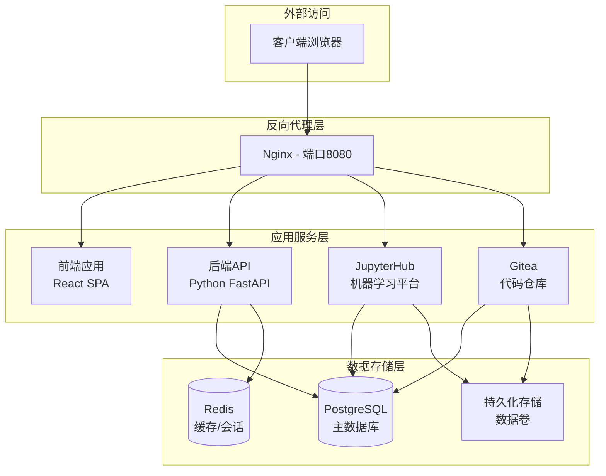

# AI Infrastructure Matrix

[](https://opensource.org/licenses/MIT)
[](https://www.docker.com/)
[](https://github.com/aresnasa/ai-infra-matrix)

> 企业级AI基础设施平台 - 集成机器学习、开发协作与统一认证

## 🌟 项目简介

AI Infrastructure Matrix 是一个全栈AI基础设施平台，提供统一的机器学习开发环境、代码协作平台和企业级认证系统。通过容器化架构，实现了开箱即用的AI开发和部署解决方案。

## help 101
```
# 查看所有镜像清单
./build.sh list-images registry.internal.com/ai-infra

# 导出所有镜像到内部仓库
./build.sh export-all registry.internal.com/ai-infra v0.3.6-dev

# 模拟模式（测试不实际执行docker操作）
SKIP_DOCKER_OPERATIONS=true ./build.sh export-all registry.example.com v1.0.0

```


### 核心特性

- 🔐 **统一身份认证** - 基于JWT的SSO系统，支持多服务单点登录
- 🐍 **JupyterHub集成** - 企业级Jupyter环境，支持GPU计算和分布式训练
- 🔧 **代码协作平台** - 集成Gitea，提供完整的Git工作流
- 🚀 **容器化部署** - Docker Compose一键部署，支持多环境配置
- 📊 **监控与日志** - 完整的健康检查和日志管理系统
- 🌐 **多注册表支持** - 支持Docker Hub、阿里云ACR等多种镜像仓库

## 🏗️ 系统架构



## 🚀 快速开始

### 前置要求

- Docker 20.10+
- Docker Compose 2.0+
- Git
- 4GB+ 可用内存

### 一键部署

```bash
# 克隆项目
git clone https://github.com/aresnasa/ai-infra-matrix.git
cd ai-infra-matrix

# 开发环境部署
./scripts/build.sh dev --up --test

# 生产环境部署
./scripts/build.sh prod --up --test
```

### 访问服务

部署完成后，通过浏览器访问：

- 🌐 **主页**: http://localhost:8080
- 🔐 **SSO登录**: http://localhost:8080/sso/
- 📊 **JupyterHub**: http://localhost:8080/jupyter
- 🗃️ **Gitea**: http://localhost:8080/gitea/

默认管理员账号：`admin` / `admin123`

## 📚 文档导航

### 用户文档
- [快速开始指南](docs/QUICK_START.md)
- [用户操作手册](docs/USER_GUIDE.md)
- [JupyterHub使用指南](docs/JUPYTERHUB_UNIFIED_AUTH_GUIDE.md)

### 开发文档
- [开发环境搭建](docs/DEVELOPMENT_SETUP.md)
- [API文档](docs/API_REFERENCE.md)
- [调试工具使用](docs/DEBUG_TOOLS.md)

### 部署文档
- [Docker Hub推送指南](docs/DOCKER-HUB-PUSH.md)
- [阿里云ACR部署指南](docs/ALIBABA_CLOUD_ACR_GUIDE.md)
- [Kubernetes部署](docs/KUBERNETES_DEPLOYMENT.md)
- [Helm Chart指南](docs/HELM_GUIDE.md)

### 运维文档
- [系统监控](docs/MONITORING.md)
- [故障排除](docs/TROUBLESHOOTING.md)
- [备份恢复](docs/BACKUP_RECOVERY.md)

### 架构文档
- [系统架构设计](docs/ARCHITECTURE.md)
- [认证系统设计](docs/AUTHENTICATION.md)
- [项目结构说明](docs/PROJECT_STRUCTURE.md)

## 🛠️ 构建与部署

### ⚠️ 重要说明

**版本参数现在是必需的！** 为了避免错误的默认版本影响构建环境，必须明确指定版本号。

### 基本构建

```bash
# 开发模式构建
./build.sh dev --version v0.3.6-dev

# 生产模式构建
./build.sh prod --version v0.3.6-dev

# 也可以使用完整路径
./scripts/all-ops.sh prod --version v0.3.6-dev
```

### 镜像推送

```bash
# 推送到Docker Hub
./build.sh prod --version v0.3.6-dev --registry docker.io/username --push

# 推送到阿里云ACR
./build.sh prod --version v0.3.6-dev --registry xxx.aliyuncs.com/ai-infra-matrix --push

# 推送依赖镜像
./build.sh prod --version v0.3.6-dev --push-deps --deps-namespace username
```

### 使用内部镜像仓库启动

如果您已经将镜像推送到内部镜像仓库，可以直接使用内部镜像启动服务：

```bash
# 使用内部仓库启动（推荐）
./build.sh start-internal registry.company.com/ai-infra/ v0.3.6-dev

# 使用默认标签启动
./build.sh start-internal registry.company.com/ai-infra/

# 停止服务
./build.sh stop

# 使用示例脚本（需要先修改配置）
./start-internal-example.sh
```

**优势：**
- 🚀 **快速启动** - 无需本地构建，直接拉取镜像
- 🔒 **企业安全** - 使用内部镜像仓库，符合企业安全要求
- 🎯 **版本控制** - 精确控制使用的镜像版本
- 📦 **离线部署** - 支持离线环境部署

详细说明请参考：[内部镜像仓库启动指南](docs/INTERNAL_REGISTRY_GUIDE.md)

### 多架构构建

```bash
# 多架构构建并推送
./scripts/build.sh prod --multi-arch --registry docker.io/username --push --version v0.3.6-dev
```

## 🎯 主要功能

### 🔐 统一身份认证系统
- JWT令牌管理
- 跨服务单点登录
- 角色权限控制
- 会话管理

### 📊 机器学习平台
- JupyterHub多用户环境
- GPU资源支持
- 自定义镜像管理
- 分布式计算支持

### 🔧 开发协作
- Git代码仓库管理
- 项目协作工作流
- 代码审查流程
- 持续集成支持

### 🚀 容器化平台
- Docker Compose编排
- 多环境配置管理
- 健康检查监控
- 自动化部署

## 🔧 配置管理

### 环境变量配置

```bash
# 开发环境
cp .env.example .env
vi .env

# 生产环境  
cp .env.example .env.prod
vi .env.prod
```

### 关键配置项

| 配置项 | 说明 | 默认值 |
|--------|------|--------|
| `POSTGRES_PASSWORD` | 数据库密码 | `ai_infra_secure_pass` |
| `JWT_SECRET_KEY` | JWT签名密钥 | 随机生成 |
| `ADMIN_USER` | 管理员用户名 | `admin` |
| `ADMIN_PASSWORD` | 管理员密码 | `admin123` |

## 🧪 测试与验证

### 健康检查

```bash
# 运行健康检查
./scripts/test-health.sh

# 完整系统测试
./scripts/test-integration-full.sh
```

### 单元测试

```bash
# 后端测试
cd src/backend && python -m pytest

# 前端测试
cd src/frontend && npm test
```

## 📈 监控与维护

### 服务状态监控

```bash
# 查看服务状态
docker compose ps

# 查看服务日志
docker compose logs -f [服务名]
```

### 数据备份

```bash
# 数据库备份
./scripts/backup-database.sh

# 完整系统备份
./scripts/backup-system.sh
```

## 🤝 贡献指南

我们欢迎所有形式的贡献！请遵循以下步骤：

1. Fork 本仓库
2. 创建功能分支 (`git checkout -b feature/amazing-feature`)
3. 提交更改 (`git commit -m 'Add amazing feature'`)
4. 推送到分支 (`git push origin feature/amazing-feature`)
5. 创建 Pull Request

### 开发规范

- 遵循PEP 8 (Python)和ESLint (JavaScript)代码规范
- 编写完整的测试用例
- 更新相关文档
- 提交前运行完整测试套件

## 📄 许可证

本项目采用 MIT 许可证。详见 [LICENSE](LICENSE) 文件。

## 🙋 支持与反馈

- 📧 邮箱：aresnasa@example.com
- 🐛 问题反馈：[GitHub Issues](https://github.com/aresnasa/ai-infra-matrix/issues)
- 💬 讨论交流：[GitHub Discussions](https://github.com/aresnasa/ai-infra-matrix/discussions)

## 🎉 致谢

感谢以下开源项目的支持：

- [JupyterHub](https://jupyterhub.readthedocs.io/) - 多用户Jupyter环境
- [Gitea](https://gitea.io/) - 轻量级Git服务
- [FastAPI](https://fastapi.tiangolo.com/) - 现代Python Web框架
- [React](https://reactjs.org/) - 用户界面库
- [PostgreSQL](https://www.postgresql.org/) - 高性能数据库
- [Redis](https://redis.io/) - 内存数据结构存储

---

<div align="center">

**AI Infrastructure Matrix** - 让AI开发更简单

[官网](https://ai-infra-matrix.example.com) • [文档](docs/) • [演示](https://demo.ai-infra-matrix.example.com)

</div>

## 附录：对象存储（MinIO）环境变量速览

- 代理路由：/minio/ (S3 API), /minio-console/ (Web 控制台，可被前端以 iframe 内嵌)
- 关键环境变量（.env/.env.example）：
    - MINIO_HOST, MINIO_PORT, MINIO_ACCESS_KEY, MINIO_SECRET_KEY
    - MINIO_REGION（默认 us-east-1）
    - MINIO_USE_SSL（默认 false）
    - MINIO_CONSOLE_URL（默认渲染为 ${EXTERNAL_SCHEME}://${EXTERNAL_HOST}:${EXTERNAL_PORT}/minio-console/）
    - MINIO_BUCKET_GITEA（Gitea 使用的桶名，默认 gitea）

修改上述变量后，重新渲染/构建并重启服务以生效。
