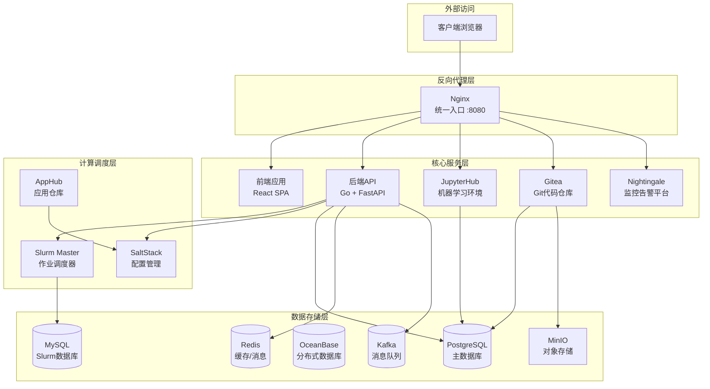

# AI Infrastructure Matrix

[](https://opensource.org/licenses/MIT)
[](https://www.docker.com/)
[](https://github.com/aresnasa/ai-infra-matrix)

> 企业级AI基础设施平台 - 集成HPC调度、机器学习环境、代码协作与统一监控

## 🌟 项目简介

AI Infrastructure Matrix 是一个企业级HPC与AI基础设施平台，提供Slurm集群管理、JupyterHub机器学习环境、Gitea代码仓库、对象存储以及Nightingale监控系统。通过容器化架构和统一的Web管理界面，实现开箱即用的AI/HPC开发和部署解决方案。

## help 101

```bash
# 查看所有镜像清单
./build.sh list-images registry.internal.com/ai-infra

# 导出所有镜像到内部仓库
./build.sh export-all registry.internal.com/ai-infra v0.3.8

# 推送依赖镜像到内部仓库
./build.sh push-dep registry.internal.com/ai-infra/

# 模拟模式（测试不实际执行docker操作）
SKIP_DOCKER_OPERATIONS=true ./build.sh export-all registry.example.com v0.3.8
```


### 核心特性

- 🖥️ **Slurm HPC调度** - 企业级作业调度系统，支持集群管理和资源调度
- 🛠️ **SaltStack自动化** - 自动化配置管理和节点部署
- 📦 **AppHub应用仓库** - Slurm/Categraf等应用包的构建和分发
- 🐍 **JupyterHub集成** - 多用户Jupyter环境，支持GPU计算
- 🗃️ **Gitea代码仓库** - 轻量级Git服务，支持S3对象存储后端
- 📦 **MinIO对象存储** - S3兼容的对象存储服务
- 📊 **Nightingale监控** - 全栈监控告警平台
- 🚀 **容器化部署** - Docker Compose一键部署，支持多环境配置
- 🌐 **多注册表支持** - 支持Docker Hub、阿里云ACR、Harbor等镜像仓库

## 🏗️ 系统架构



## 🚀 快速开始

### 前置要求

- Docker 20.10+
- Docker Compose 2.0+
- Git
- 4GB+ 可用内存

### 一键部署

```bash
# 克隆项目
git clone https://github.com/aresnasa/ai-infra-matrix.git
cd ai-infra-matrix

# 配置环境变量
cp .env.example .env
# 编辑 .env 文件，配置必要的参数

# 构建并启动服务
./build.sh build-all v0.3.8
docker compose up -d
```

### 访问服务

部署完成后，通过浏览器访问：

- 🌐 **主页**: <http://localhost:8080>
- 📊 **JupyterHub**: <http://localhost:8080/jupyter>
- 🗃️ **Gitea**: <http://localhost:8080/gitea/>
- 📈 **Nightingale**: <http://localhost:8080/n9e>
- 📦 **MinIO控制台**: <http://localhost:8080/minio-console/>

默认管理员账号：`admin` / `admin123`

## 📚 文档导航

### 用户文档

- [快速开始指南](docs/QUICK_START.md)
- [用户操作手册](docs/USER_GUIDE.md)
- [JupyterHub使用指南](docs/JUPYTERHUB_UNIFIED_AUTH_GUIDE.md)

### 开发文档

- [开发环境搭建](docs/DEVELOPMENT_SETUP.md)
- [API文档](docs/API_REFERENCE.md)
- [调试工具使用](docs/DEBUG_TOOLS.md)

### 部署文档

- [Docker Hub推送指南](docs/DOCKER-HUB-PUSH.md)
- [阿里云ACR部署指南](docs/ALIBABA_CLOUD_ACR_GUIDE.md)
- [Kubernetes部署](docs/KUBERNETES_DEPLOYMENT.md)
- [Helm Chart指南](docs/HELM_GUIDE.md)

### 运维文档

- [系统监控](docs/MONITORING.md)
- [故障排除](docs/TROUBLESHOOTING.md)
- [备份恢复](docs/BACKUP_RECOVERY.md)

### 架构文档

- [系统架构设计](docs/ARCHITECTURE.md)
- [认证系统设计](docs/AUTHENTICATION.md)
- [项目结构说明](docs/PROJECT_STRUCTURE.md)

## 🛠️ 构建与部署

### ⚠️ 重要说明

**版本参数现在是必需的！** 为了避免错误的默认版本影响构建环境，必须明确指定版本号。

### 基本构建

```bash
# 开发模式构建
./build.sh dev --version v0.3.8

# 生产模式构建
./build.sh prod --version v0.3.8

# 也可以使用完整路径
./scripts/all-ops.sh prod --version v0.3.8
```

### 镜像推送

```bash
# 推送到Docker Hub
./build.sh prod --version v0.3.8 --registry docker.io/username --push

# 推送到阿里云ACR
./build.sh prod --version v0.3.8 --registry xxx.aliyuncs.com/ai-infra-matrix --push

# 推送依赖镜像
./build.sh push-dep registry.internal.com/ai-infra/
```

### 使用内部镜像仓库启动

如果您已经将镜像推送到内部镜像仓库，可以直接使用内部镜像启动服务：

```bash
# 使用内部仓库启动（推荐）
./build.sh start-internal registry.company.com/ai-infra/ v0.3.8

# 使用默认标签启动
./build.sh start-internal registry.company.com/ai-infra/

# 停止服务
./build.sh stop

# 使用示例脚本（需要先修改配置）
./start-internal-example.sh
```

**优势：**

- 🚀 **快速启动** - 无需本地构建，直接拉取镜像
- 🔒 **企业安全** - 使用内部镜像仓库，符合企业安全要求
- 🎯 **版本控制** - 精确控制使用的镜像版本
- 📦 **离线部署** - 支持离线环境部署

详细说明请参考：[内部镜像仓库启动指南](docs/INTERNAL_REGISTRY_GUIDE.md)

### 多架构构建

```bash
# 多架构构建并推送
./build.sh prod --multi-arch --registry docker.io/username --push --version v0.3.8
```

## ⚙️ SLURM 配置与 MPI

- 全局 `slurm.conf` 模板现在存放在 `src/backend/config/slurm/slurm.conf.base`，后端服务会在每次下发配置前动态读取该文件并追加节点/分区信息。
- 如需放置在其他位置，可通过环境变量 `SLURM_BASE_CONFIG_PATH` 显式指定模板路径；该文件会被同步到 `slurm-master` 与所有计算节点容器中。
- 模板内启用了 `MpiDefault=pmix`，所以需要在自定义镜像或物理节点中提供 `pmix`/`libpmix` 运行时（项目提供的 `slurm-master` 镜像与自动化节点安装脚本已默认安装这些依赖）。
- 修改模板后可以直接调用“刷新 SLURM 配置”按钮或 `UpdateSlurmConfig` 接口立即同步，无需重新编译后端程序。

## 🎯 主要功能

### 🖥️ Slurm HPC调度系统

- 作业提交和队列管理
- 节点资源监控和分配
- 分区(Partition)配置
- 集成SaltStack自动化部署

### 🛠️ SaltStack配置管理

- 自动化节点部署
- 配置文件同步
- 远程命令执行
- Minion状态管理

### 📦 AppHub应用仓库

- Slurm RPM/DEB包构建
- Categraf监控代理打包
- 多架构支持(x86_64/aarch64)
- 版本管理和分发

### 📊 JupyterHub机器学习平台

- 多用户Jupyter环境
- GPU资源支持
- 自定义镜像管理
- 持久化存储

### 🗃️ Gitea代码仓库

- Git仓库托管
- Pull Request工作流
- S3对象存储后端
- Web界面管理

### 📦 MinIO对象存储

- S3兼容API
- Web管理控制台
- Gitea LFS后端存储
- 多租户支持

### 📈 Nightingale监控系统

- 指标采集和展示
- 告警规则配置
- 仪表盘可视化
- Prometheus兼容

## 🔧 配置管理

### 环境变量配置

```bash
# 开发环境
cp .env.example .env
vi .env

# 生产环境  
cp .env.example .env.prod
vi .env.prod
```

### 关键配置项

| 配置项 | 说明 | 默认值 |
|--------|------|--------|
| `POSTGRES_PASSWORD` | PostgreSQL数据库密码 | `postgres` |
| `MYSQL_ROOT_PASSWORD` | MySQL root密码 | `mysql123` |
| `SLURM_DB_PASSWORD` | Slurm数据库密码 | `slurm123` |
| `MINIO_ROOT_USER` | MinIO管理员用户 | `minioadmin` |
| `MINIO_ROOT_PASSWORD` | MinIO管理员密码 | `minioadmin` |
| `ADMIN_USER` | Web管理员用户名 | `admin` |
| `ADMIN_PASSWORD` | Web管理员密码 | `admin123` |
| `EXTERNAL_HOST` | 外部访问地址 | `localhost` |
| `EXTERNAL_PORT` | 外部访问端口 | `8080` |

## 🧪 测试与验证

### 健康检查

```bash
# 查看服务状态
docker compose ps

# 查看服务日志
docker compose logs -f [服务名]

# 测试API端点
curl http://localhost:8080/api/health
```

## 📈 监控与维护

### 服务状态监控

```bash
# 查看服务状态
docker compose ps

# 查看服务日志
docker compose logs -f [服务名]

# 访问Nightingale监控面板
# http://localhost:8080/n9e
```

### 数据备份

```bash
# PostgreSQL备份
docker exec ai-infra-postgres pg_dump -U postgres ai-infra-matrix > backup.sql

# MySQL备份
docker exec ai-infra-mysql mysqldump -u root -p slurm_acct_db > slurm_backup.sql

# MinIO数据备份
docker exec ai-infra-minio mc mirror /data /backup
```

## 🤝 贡献指南

我们欢迎所有形式的贡献！请遵循以下步骤：

1. Fork 本仓库
2. 创建功能分支 (`git checkout -b feature/amazing-feature`)
3. 提交更改 (`git commit -m 'Add amazing feature'`)
4. 推送到分支 (`git push origin feature/amazing-feature`)
5. 创建 Pull Request

### 开发规范

- 遵循Go和JavaScript代码规范
- 编写完整的测试用例
- 更新相关文档
- 提交前运行完整测试套件

## 📄 许可证

本项目采用 MIT 许可证。详见 [LICENSE](LICENSE) 文件。

## 🙋 支持与反馈

- 📧 邮箱：[aresnasa@example.com](mailto:aresnasa@example.com)
- 🐛 问题反馈：[GitHub Issues](https://github.com/aresnasa/ai-infra-matrix/issues)
- 💬 讨论交流：[GitHub Discussions](https://github.com/aresnasa/ai-infra-matrix/discussions)

## 🎉 致谢

感谢以下开源项目的支持：

- [Slurm](https://slurm.schedmd.com/) - HPC作业调度系统
- [SaltStack](https://saltproject.io/) - 配置管理和自动化
- [JupyterHub](https://jupyterhub.readthedocs.io/) - 多用户Jupyter环境
- [Gitea](https://gitea.io/) - 轻量级Git服务
- [MinIO](https://min.io/) - 高性能对象存储
- [Nightingale](https://n9e.github.io/) - 监控告警平台
- [PostgreSQL](https://www.postgresql.org/) - 高性能关系数据库
- [MySQL](https://www.mysql.com/) - 开源关系数据库
- [OceanBase](https://www.oceanbase.com/) - 分布式数据库
- [Redis](https://redis.io/) - 内存数据结构存储
- [Kafka](https://kafka.apache.org/) - 分布式消息队列
- [React](https://reactjs.org/) - 用户界面库
- [Go](https://golang.org/) - 高性能编程语言

---

**AI Infrastructure Matrix** - 让AI开发更简单

[官网](https://ai-infra-matrix.example.com) • [文档](docs/) • [演示](https://demo.ai-infra-matrix.example.com)

---

## 附录：对象存储（MinIO）环境变量速览

- 代理路由：/minio/ (S3 API), /minio-console/ (Web 控制台，可被前端以 iframe 内嵌)
- 关键环境变量（.env/.env.example）：
  - MINIO_HOST, MINIO_PORT, MINIO_ACCESS_KEY, MINIO_SECRET_KEY
  - MINIO_REGION（默认 us-east-1）
  - MINIO_USE_SSL（默认 false）
  - MINIO_CONSOLE_URL（默认渲染为 ${EXTERNAL_SCHEME}://${EXTERNAL_HOST}:${EXTERNAL_PORT}/minio-console/）
  - MINIO_BUCKET_GITEA（Gitea 使用的桶名，默认 gitea）

修改上述变量后，重新渲染/构建并重启服务以生效。
