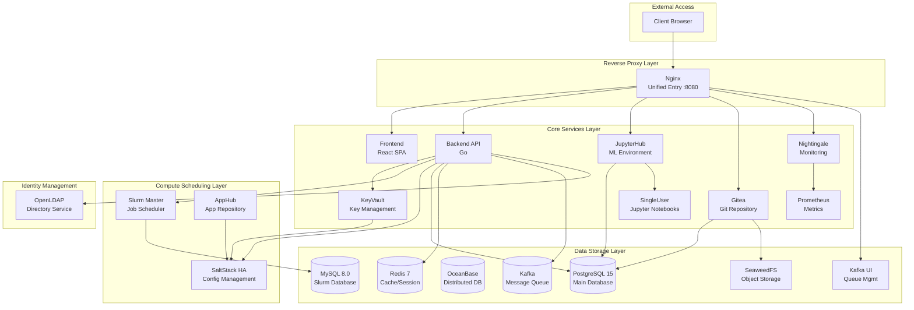
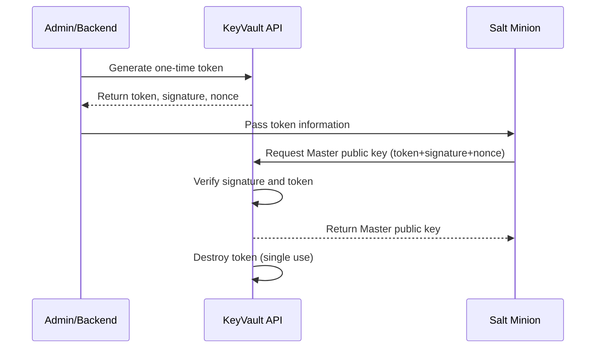

# AI Infrastructure Matrix

[](https://opensource.org/licenses/Apache-2.0)
[](https://www.docker.com/)
[](https://github.com/aresnasa/ai-infra-matrix)

**English** | **[中文](README_zh_CN.md)**

> Enterprise-grade AI Infrastructure Platform - Integrating HPC Scheduling, Machine Learning Environments, Code Collaboration and Unified Monitoring

## 🌟 Overview

AI Infrastructure Matrix is an enterprise-grade HPC and AI infrastructure platform, providing Slurm cluster management, JupyterHub machine learning environments, Gitea code repositories, object storage, and Nightingale monitoring systems. Through containerized architecture and a unified web management interface, it delivers an out-of-the-box AI/HPC development and deployment solution.

## Quick Help

```bash
# List all images
./build.sh list-images registry.internal.com/ai-infra

# Export all images to internal registry
./build.sh export-all registry.internal.com/ai-infra v0.3.8

# Push dependency images to internal registry
./build.sh push-dep registry.internal.com/ai-infra/

# Dry-run mode (test without actual docker operations)
SKIP_DOCKER_OPERATIONS=true ./build.sh export-all registry.example.com v0.3.8
```

### Core Features

- 🖥️ **Slurm HPC Scheduling** - Enterprise job scheduling system with cluster management and resource allocation
- 🛠️ **SaltStack Automation** - Automated configuration management and node deployment
- 🔐 **KeyVault Security** - Secure key and certificate distribution with one-time token mechanism
- 📦 **AppHub Repository** - Build and distribution for Slurm/Categraf and other application packages
- 🐍 **JupyterHub Integration** - Multi-user Jupyter environment with GPU computing support
- 🗃️ **Gitea Repository** - Lightweight Git service with S3 object storage backend
- 📦 **SeaweedFS Object Storage** - S3-compatible high-performance distributed object storage
- 📊 **Nightingale Monitoring** - Full-stack monitoring and alerting platform
- 🚀 **Containerized Deployment** - One-click deployment with Docker Compose, multi-environment support
- 🌐 **Multi-Registry Support** - Docker Hub, Alibaba Cloud ACR, Harbor and other registries

## 🏗️ System Architecture



## 📦 Component List

### Core Services (`src/`)

| Component | Description | Technology Stack |
|-----------|-------------|------------------|
| `backend` | Backend API Service | Go, Gin, GORM |
| `frontend` | Web Frontend | React, Ant Design |
| `nginx` | Reverse Proxy | Nginx Alpine |
| `saltstack` | Configuration Management (HA) | SaltStack, Salt-API |
| `apphub` | Application Package Repository | AlmaLinux, RPM/DEB |
| `jupyterhub` | ML Environment | JupyterHub, Python |
| `singleuser` | Jupyter Notebook Instance | Jupyter, CUDA |
| `gitea` | Git Repository | Gitea 1.25 |
| `nightingale` | Monitoring Platform | Nightingale, Go |
| `prometheus` | Metrics Collection | Prometheus |
| `slurm-master` | HPC Job Scheduler | Slurm 25.05 |

### Data Services

| Component | Version | Description |
|-----------|---------|-------------|
| PostgreSQL | 15-alpine | Main database |
| MySQL | 8.0 | Slurm accounting database |
| OceanBase | 4.3.5-lts | Distributed database |
| Redis | 7-alpine | Cache and session storage |
| Kafka | 7.5.0 | Message queue |
| SeaweedFS | latest | S3-compatible object storage |

### Identity & Security

| Component | Description |
|-----------|-------------|
| OpenLDAP | Directory service for user authentication |
| PHPLDAPAdmin | LDAP web management interface |
| KeyVault | Secure key distribution service |

## 🚀 Quick Start

### Prerequisites

- Docker 20.10+
- Docker Compose 2.0+
- Git
- 4GB+ available memory

### One-Click Deployment

```bash
# Clone the project
git clone https://github.com/aresnasa/ai-infra-matrix.git
cd ai-infra-matrix

# Configure environment variables
cp .env.example .env
# Edit .env file to configure necessary parameters

# Build and start services
./build.sh build-all v0.3.8
docker compose up -d
```

### Access Services

After deployment, access via browser:

- 🌐 **Homepage**: <http://localhost:8080>
- 📊 **JupyterHub**: <http://localhost:8080/jupyter>
- 🗃️ **Gitea**: <http://localhost:8080/gitea/>
- 📈 **Nightingale**: <http://localhost:8080/n9e>
- 📦 **SeaweedFS Console**: <http://localhost:8080/seaweedfs/>

Default admin account: `admin` / `admin123`

## 📚 Documentation

### User Documentation

- [User Guide](docs/en/USER_GUIDE.md)
- [API Reference](docs/en/API_REFERENCE.md)

### Architecture & Design

- [System Architecture](docs/en/ARCHITECTURE.md)
- [Authentication System](docs/en/AUTHENTICATION.md)

### Deployment

- [Docker Hub Push Guide](docs/en/DOCKER-HUB-PUSH.md)
- [Kubernetes Deployment](docs/en/KUBERNETES_DEPLOYMENT.md)
- [Helm Chart Guide](docs/en/HELM_GUIDE.md)

### Operations

- [Monitoring Guide](docs/en/MONITORING.md)
- [Troubleshooting](docs/en/TROUBLESHOOTING.md)
- [Backup & Recovery](docs/en/BACKUP_RECOVERY.md)

### Chinese Documentation

Chinese versions are available in [docs/zh_CN/](docs/zh_CN/)

## 🛠️ Build & Deploy

### Environment Initialization

```bash
# Auto-detect and initialize .env file (recommended)
./build.sh init-env

# Use specified external address
./build.sh init-env 192.168.0.100

# Force re-initialization
./build.sh init-env --force
```

### Production Environment Generation

```bash
# Generate .env.prod with secure random passwords (recommended for production)
./build.sh gen-prod-env

# Specify output file
./build.sh gen-prod-env .env.production

# Force overwrite existing file
./build.sh gen-prod-env --force
```

**Generated Password Variables:**
- Database: `POSTGRES_PASSWORD`, `MYSQL_ROOT_PASSWORD`, `REDIS_PASSWORD`
- Authentication: `JWT_SECRET`, `ENCRYPTION_KEY`, `SESSION_SECRET`, `JUPYTERHUB_CRYPT_KEY`
- Storage: `SEAWEEDFS_ACCESS_KEY`, `SEAWEEDFS_SECRET_KEY`
- Services: `GITEA_ADMIN_PASSWORD`, `GITEA_ADMIN_TOKEN`
- LDAP: `LDAP_ADMIN_PASSWORD`, `LDAP_CONFIG_PASSWORD`
- Slurm: `SLURM_DB_PASSWORD`, `SLURM_MUNGE_KEY`
- Automation: `SALT_API_PASSWORD`, `SALTSTACK_API_TOKEN`

**Using the Generated Production Config:**

```bash
# Step 1: Generate production environment file
./build.sh gen-prod-env

# Step 2: Review and customize settings
vi .env.prod
# - Set EXTERNAL_HOST to your server IP or domain
# - Set DOMAIN for DNS-based access
# - Adjust other settings as needed

# Step 3: Apply to deployment
cp .env.prod .env

# Step 4: Render templates with new config
./build.sh render

# Step 5: Build and deploy
./build.sh build-all
docker compose up -d
```

> ⚠️ **Important Security Notes:**
>
> - Save the generated passwords securely (password manager recommended)
> - The default admin account `admin/admin123` is NOT changed by this script
> - **Change admin password via Web UI immediately after first login**
> - Never commit `.env.prod` to version control

### Template Rendering

```bash
# Render all Dockerfile.tpl and config templates
./build.sh render

# Force re-render (ignore cache)
./build.sh render --force
```

### Build Commands

```bash
# Build all services (in correct order)
./build.sh build-all

# Force rebuild all services (no cache)
./build.sh build-all --force

# Build single component
./build.sh backend
./build.sh frontend

# Force rebuild single component
./build.sh backend --force
```

### Service Management

```bash
# Start all services
./build.sh start-all

# Stop all services
./build.sh stop-all

# Tag images for private registry
./build.sh tag-images
```

### Image Pull (Smart Mode)

```bash
# Pre-pull all base images
./build.sh prefetch

# Pull public/third-party images (mysql, redis, kafka, etc.)
./build.sh pull-common

# Internet mode: Pull from Docker Hub
./build.sh pull-all

# Intranet mode: Pull from private registry (requires project path)
./build.sh pull-all harbor.example.com/ai-infra v0.3.8

# Pull dependency images
./build.sh deps-pull harbor.example.com/ai-infra v0.3.8
```

### Image Push

```bash
# Push single service to registry
./build.sh push backend harbor.example.com/ai-infra v0.3.8

# Push all images (4 stages: common, deps, project, special)
./build.sh push-all harbor.example.com/ai-infra v0.3.8

# Push dependency images
./build.sh push-dep harbor.example.com/ai-infra v0.3.8
```

> ⚠️ **Harbor Private Registry Note**: Path must include project name
>
> - ✓ `harbor.example.com/ai-infra` (correct)
> - ✗ `harbor.example.com` (wrong - missing project name)

### Offline Deployment

```bash
# Export all images to tar files
./build.sh export-offline ./offline-images v0.3.8

# Export excluding common images
./build.sh export-offline ./offline-images v0.3.8 false

# Import in offline environment
cd ./offline-images && ./import-images.sh
```

### Cleanup Commands

```bash
# Clean project images (optionally specify tag)
./build.sh clean-images v0.3.8

# Clean project data volumes
./build.sh clean-volumes

# Full cleanup (stop containers, delete images and volumes)
./build.sh clean-all --force
```

### Global Options

All commands support the following global options:

- `--force` / `-f` / `--no-cache`: Force rebuild without Docker cache

### Dry-Run Mode

```bash
# Test mode: Skip actual Docker operations
SKIP_DOCKER_OPERATIONS=true ./build.sh export-all registry.example.com v0.3.8
```

## ⚙️ SLURM Configuration & MPI

- The global `slurm.conf` template is now stored at `src/backend/config/slurm/slurm.conf.base`. The backend service reads this file dynamically before each config deployment and appends node/partition information.
- To use a different location, set the `SLURM_BASE_CONFIG_PATH` environment variable explicitly; this file will be synced to `slurm-master` and all compute node containers.
- The template enables `MpiDefault=pmix`, so you need to provide `pmix`/`libpmix` runtime in custom images or physical nodes (the project's `slurm-master` image and automated node installation scripts include these dependencies by default).
- After modifying the template, you can immediately sync by clicking "Refresh SLURM Config" button or calling the `UpdateSlurmConfig` API without recompiling the backend.

## 🎯 Main Features

### 🖥️ Slurm HPC Scheduling System

- Job submission and queue management
- Node resource monitoring and allocation
- Partition configuration
- Integrated SaltStack automated deployment

### 🛠️ SaltStack Configuration Management

- Automated node deployment
- Configuration file synchronization
- Remote command execution
- Minion status management
- **Secure key distribution** - One-time token mechanism ensures secure Salt Master public key transmission

### 🔐 KeyVault Security Service

KeyVault is the platform's secure key management service, providing:

- **One-time token mechanism** - Generate single-use security tokens for key distribution
- **Salt Master public key secure distribution** - Ensure Minion nodes securely obtain Master public key
- **HMAC signature verification** - Use HMAC-SHA256 signatures to ensure request integrity
- **Nonce replay protection** - Prevent token replay attacks
- **Auto-expiration mechanism** - Tokens expire in 5 minutes by default, configurable

**Workflow:**



**Security Features:**

- ✅ Single-use tokens, destroyed immediately after retrieval
- ✅ HMAC signature prevents token tampering
- ✅ Nonce prevents replay attacks
- ✅ Token expiration limit
- ✅ Request timeout limit (default 10 seconds)

See [Salt Key Security Distribution Design Document](docs-all/SALT_KEY_SECURITY.md) for details.

### 📦 AppHub Application Repository

- Slurm RPM/DEB package building
- Categraf monitoring agent packaging
- Multi-architecture support (x86_64/aarch64)
- Version management and distribution

### 📊 JupyterHub Machine Learning Platform

- Multi-user Jupyter environment
- GPU resource support
- Custom image management
- Persistent storage

### 🗃️ Gitea Code Repository

- Git repository hosting
- Pull Request workflow
- S3 object storage backend
- Web interface management

### 📦 SeaweedFS Object Storage

- S3-compatible API
- High-performance distributed storage
- Gitea LFS backend storage
- Filer Web management console

### 📈 Nightingale Monitoring System

- Metrics collection and display
- Alert rule configuration
- Dashboard visualization
- Prometheus compatible

### 👥 RBAC Permission Management System

The platform provides a complete Role-Based Access Control (RBAC) system:

**Predefined Role Templates:**

| Role Template | Description | Main Permissions |
|---------------|-------------|------------------|
| `admin` | System Administrator | All permissions |
| `sre` | SRE Operations Engineer | SaltStack, Ansible, Kubernetes, Host management |
| `data-developer` | Data Developer | JupyterHub, Project management, Data analysis |
| `model-developer` | Model Developer | JupyterHub, Project management |
| `engineer` | Software Engineer | Kubernetes, Project management |

**Features:**

- 🔐 Role inheritance and permission combination
- 🔑 Resource-level permission control
- 👥 User group management
- 📋 Permission audit logging

## 🔧 Configuration Management

### Environment Variable Configuration

```bash
# Development environment
cp .env.example .env
vi .env

# Production environment  
cp .env.example .env.prod
vi .env.prod
```

### Key Configuration Items

| Configuration | Description | Default |
|---------------|-------------|---------|
| `POSTGRES_PASSWORD` | PostgreSQL database password | `postgres` |
| `MYSQL_ROOT_PASSWORD` | MySQL root password | `mysql123` |
| `SLURM_DB_PASSWORD` | Slurm database password | `slurm123` |
| `SEAWEEDFS_S3_ACCESS_KEY` | SeaweedFS S3 access key | `seaweedfs_admin` |
| `SEAWEEDFS_S3_SECRET_KEY` | SeaweedFS S3 secret key | `seaweedfs_secret_key_change_me` |
| `ADMIN_USER` | Web admin username | `admin` |
| `ADMIN_PASSWORD` | Web admin password | `admin123` |
| `EXTERNAL_HOST` | External access address | `localhost` |
| `EXTERNAL_PORT` | External access port | `8080` |

## 🧪 Testing & Verification

### Health Check

```bash
# View service status
docker compose ps

# View service logs
docker compose logs -f [service-name]

# Test API endpoint
curl http://localhost:8080/api/health
```

## 📈 Monitoring & Maintenance

### Service Status Monitoring

```bash
# View service status
docker compose ps

# View service logs
docker compose logs -f [service-name]

# Access Nightingale monitoring panel
# http://localhost:8080/n9e
```

### Data Backup

```bash
# PostgreSQL backup
docker exec ai-infra-postgres pg_dump -U postgres ai-infra-matrix > backup.sql

# MySQL backup
docker exec ai-infra-mysql mysqldump -u root -p slurm_acct_db > slurm_backup.sql

# SeaweedFS data backup
aws --endpoint-url http://localhost:8333 s3 sync s3://gitea ./seaweedfs_backup/
```

## 🤝 Contributing

We welcome all forms of contributions! Please follow these steps:

1. Fork this repository
2. Create a feature branch (`git checkout -b feature/amazing-feature`)
3. Commit your changes (`git commit -m 'Add amazing feature'`)
4. Push to the branch (`git push origin feature/amazing-feature`)
5. Create a Pull Request

### Development Guidelines

- Follow Go and JavaScript code standards
- Write complete test cases
- Update relevant documentation
- Run the complete test suite before committing

## 📄 License

This project is licensed under the Apache License 2.0. See [LICENSE](LICENSE) file for details.

## 🙋 Support & Feedback

- 📧 Email: [ai_infra_matrix](mailto:ai_infra_matrix@126.com)
- 🐛 Issues: [GitHub Issues](https://github.com/aresnasa/ai-infra-matrix/issues)
- 💬 Discussions: [GitHub Discussions](https://github.com/aresnasa/ai-infra-matrix/discussions)

## 🎉 Acknowledgements

Thanks to the following open source projects:

- [Slurm](https://slurm.schedmd.com/) - HPC job scheduling system
- [SaltStack](https://saltproject.io/) - Configuration management and automation
- [JupyterHub](https://jupyterhub.readthedocs.io/) - Multi-user Jupyter environment
- [Gitea](https://gitea.io/) - Lightweight Git service
- [SeaweedFS](https://github.com/seaweedfs/seaweedfs) - High-performance distributed object storage
- [Nightingale](https://n9e.github.io/) - Monitoring and alerting platform
- [PostgreSQL](https://www.postgresql.org/) - High-performance relational database
- [MySQL](https://www.mysql.com/) - Open source relational database
- [OceanBase](https://www.oceanbase.com/) - Distributed database
- [Redis](https://redis.io/) - In-memory data structure store
- [Kafka](https://kafka.apache.org/) - Distributed message queue
- [React](https://reactjs.org/) - User interface library
- [Go](https://golang.org/) - High-performance programming language

---

**AI Infrastructure Matrix** - Making AI Development Simpler

[Website](https://ai-infra-matrix.example.com) • [Documentation](docs/) • [Demo](https://demo.ai-infra-matrix.example.com)

---

## Appendix: Object Storage (SeaweedFS) Environment Variables

- Proxy routes: /seaweedfs/ (Filer Web UI), /seaweedfs-s3/ (S3 API)
- Key environment variables (.env/.env.example):
  - SEAWEEDFS_S3_ACCESS_KEY, SEAWEEDFS_S3_SECRET_KEY
  - SEAWEEDFS_MASTER_URL, SEAWEEDFS_FILER_URL, SEAWEEDFS_S3_PORT
  - SEAWEEDFS_JWT_SECRET
  - SEAWEEDFS_BUCKET_GITEA (bucket name used by Gitea, default: gitea)

After modifying these variables, re-render/build and restart services to take effect.
