# AI Infrastructure Matrix

[](https://opensource.org/licenses/MIT)
[](https://www.docker.com/)
[](https://github.com/aresnasa/ai-infra-matrix)

> 企业级AI基础设施平台 - 集成HPC调度、机器学习环境、代码协作与统一监控

## 🌟 项目简介

AI Infrastructure Matrix 是一个企业级HPC与AI基础设施平台，提供Slurm集群管理、JupyterHub机器学习环境、Gitea代码仓库、对象存储以及Nightingale监控系统。通过容器化架构和统一的Web管理界面，实现开箱即用的AI/HPC开发和部署解决方案。

## help 101

```bash
# 查看所有镜像清单
./build.sh list-images registry.internal.com/ai-infra

# 导出所有镜像到内部仓库
./build.sh export-all registry.internal.com/ai-infra v0.3.8

# 推送依赖镜像到内部仓库
./build.sh push-dep registry.internal.com/ai-infra/

# 模拟模式（测试不实际执行docker操作）
SKIP_DOCKER_OPERATIONS=true ./build.sh export-all registry.example.com v0.3.8
```


### 核心特性

- 🖥️ **Slurm HPC调度** - 企业级作业调度系统，支持集群管理和资源调度
- 🛠️ **SaltStack自动化** - 自动化配置管理和节点部署
- 🔐 **KeyVault安全管理** - 安全的密钥和证书分发，一次性令牌机制
- 📦 **AppHub应用仓库** - Slurm/Categraf等应用包的构建和分发
- 🐍 **JupyterHub集成** - 多用户Jupyter环境，支持GPU计算
- 🗃️ **Gitea代码仓库** - 轻量级Git服务，支持S3对象存储后端
- 📦 **MinIO对象存储** - S3兼容的对象存储服务
- 📊 **Nightingale监控** - 全栈监控告警平台
- 🚀 **容器化部署** - Docker Compose一键部署，支持多环境配置
- 🌐 **多注册表支持** - 支持Docker Hub、阿里云ACR、Harbor等镜像仓库

## 🏗️ 系统架构

```mermaid
graph TB
    subgraph "外部访问"
        Client[客户端浏览器]
    end
    
    subgraph "反向代理层"
        Nginx[Nginx<br/>统一入口 :8080]
    end
    
    subgraph "核心服务层"
        Frontend[前端应用<br/>React SPA]
        Backend[后端API<br/>Go + FastAPI]
        KeyVault[KeyVault<br/>密钥管理服务]
        JupyterHub[JupyterHub<br/>机器学习环境]
        Gitea[Gitea<br/>Git代码仓库]
        Nightingale[Nightingale<br/>监控告警平台]
    end
    
    subgraph "计算调度层"
        SlurmMaster[Slurm Master<br/>作业调度器]
        SaltStack[SaltStack<br/>配置管理]
        AppHub[AppHub<br/>应用仓库]
    end
    
    subgraph "数据存储层"
        Postgres[(PostgreSQL<br/>主数据库)]
        MySQL[(MySQL<br/>Slurm数据库)]
        OceanBase[(OceanBase<br/>分布式数据库)]
        Redis[(Redis<br/>缓存/消息)]
        Kafka[(Kafka<br/>消息队列)]
        MinIO[MinIO<br/>对象存储]
    end
    
    Client --> Nginx
    Nginx --> Frontend
    Nginx --> Backend
    Nginx --> JupyterHub
    Nginx --> Gitea
    Nginx --> Nightingale
    
    Backend --> KeyVault
    Backend --> SlurmMaster
    Backend --> SaltStack
    Backend --> Postgres
    Backend --> Redis
    Backend --> Kafka
    
    KeyVault --> SaltStack
    JupyterHub --> Postgres
    Gitea --> Postgres
    Gitea --> MinIO
    SlurmMaster --> MySQL
    AppHub --> SaltStack
```



## 🚀 快速开始

### 前置要求

- Docker 20.10+
- Docker Compose 2.0+
- Git
- 4GB+ 可用内存

### 一键部署

```bash
# 克隆项目
git clone https://github.com/aresnasa/ai-infra-matrix.git
cd ai-infra-matrix

# 配置环境变量
cp .env.example .env
# 编辑 .env 文件，配置必要的参数

# 构建并启动服务
./build.sh build-all v0.3.8
docker compose up -d
```

### 访问服务

部署完成后，通过浏览器访问：

- 🌐 **主页**: <http://localhost:8080>
- 📊 **JupyterHub**: <http://localhost:8080/jupyter>
- 🗃️ **Gitea**: <http://localhost:8080/gitea/>
- 📈 **Nightingale**: <http://localhost:8080/n9e>
- 📦 **MinIO控制台**: <http://localhost:8080/minio-console/>

默认管理员账号：`admin` / `admin123`

## 📚 文档导航

### 用户文档

- [快速开始指南](docs/QUICK_START.md)
- [用户操作手册](docs/USER_GUIDE.md)
- [JupyterHub使用指南](docs/JUPYTERHUB_UNIFIED_AUTH_GUIDE.md)

### 开发文档

- [开发环境搭建](docs/DEVELOPMENT_SETUP.md)
- [API文档](docs/API_REFERENCE.md)
- [调试工具使用](docs/DEBUG_TOOLS.md)

### 部署文档

- [Docker Hub推送指南](docs/DOCKER-HUB-PUSH.md)
- [阿里云ACR部署指南](docs/ALIBABA_CLOUD_ACR_GUIDE.md)
- [Kubernetes部署](docs/KUBERNETES_DEPLOYMENT.md)
- [Helm Chart指南](docs/HELM_GUIDE.md)

### 运维文档

- [系统监控](docs/MONITORING.md)
- [故障排除](docs/TROUBLESHOOTING.md)
- [备份恢复](docs/BACKUP_RECOVERY.md)

### 架构文档

- [系统架构设计](docs/ARCHITECTURE.md)
- [认证系统设计](docs/AUTHENTICATION.md)
- [Salt Key安全分发](docs-all/SALT_KEY_SECURITY.md)
- [项目结构说明](docs/PROJECT_STRUCTURE.md)

## 🛠️ 构建与部署

### 环境初始化

```bash
# 自动检测并初始化 .env 文件（推荐）
./build.sh init-env

# 使用指定的外部地址
./build.sh init-env 192.168.0.100

# 强制重新初始化
./build.sh init-env --force
```

### 模板渲染

```bash
# 渲染所有 Dockerfile.tpl 和配置模板
./build.sh render

# 强制重新渲染（忽略缓存）
./build.sh render --force
```

### 构建命令

```bash
# 构建所有服务（按正确顺序）
./build.sh build-all

# 强制重建所有服务（无缓存）
./build.sh build-all --force

# 构建单个组件
./build.sh backend
./build.sh frontend

# 强制重建单个组件
./build.sh backend --force
```

### 服务管理

```bash
# 启动所有服务
./build.sh start-all

# 停止所有服务
./build.sh stop-all

# 为私有仓库镜像打本地标签
./build.sh tag-images
```

### 镜像拉取（智能模式）

```bash
# 预拉取所有基础镜像
./build.sh prefetch

# 拉取公共/第三方镜像（mysql, redis, kafka等）
./build.sh pull-common

# 互联网模式：从 Docker Hub 拉取
./build.sh pull-all

# 内网模式：从私有仓库拉取（需要 project 路径）
./build.sh pull-all harbor.example.com/ai-infra v0.3.8

# 拉取依赖镜像
./build.sh deps-pull harbor.example.com/ai-infra v0.3.8
```

### 镜像推送

```bash
# 推送单个服务到仓库
./build.sh push backend harbor.example.com/ai-infra v0.3.8

# 推送所有镜像（4个阶段：通用、依赖、项目、特殊）
./build.sh push-all harbor.example.com/ai-infra v0.3.8

# 推送依赖镜像
./build.sh push-dep harbor.example.com/ai-infra v0.3.8
```

> ⚠️ **Harbor 私有仓库注意事项**：路径必须包含项目名
>
> - ✓ `harbor.example.com/ai-infra`（正确）
> - ✗ `harbor.example.com`（错误 - 缺少项目名）

### 离线部署

```bash
# 导出所有镜像到 tar 文件
./build.sh export-offline ./offline-images v0.3.8

# 导出时排除公共镜像
./build.sh export-offline ./offline-images v0.3.8 false

# 在离线环境导入
cd ./offline-images && ./import-images.sh
```

### 清理命令

```bash
# 清理项目镜像（可选指定标签）
./build.sh clean-images v0.3.8

# 清理项目数据卷
./build.sh clean-volumes

# 完全清理（停止容器、删除镜像和数据卷）
./build.sh clean-all --force
```

### 全局选项

所有命令都支持以下全局选项：

- `--force` / `-f` / `--no-cache`：强制重建，不使用 Docker 缓存

### 模拟模式

```bash
# 测试模式：跳过实际的 Docker 操作
SKIP_DOCKER_OPERATIONS=true ./build.sh export-all registry.example.com v0.3.8
```

## ⚙️ SLURM 配置与 MPI

- 全局 `slurm.conf` 模板现在存放在 `src/backend/config/slurm/slurm.conf.base`，后端服务会在每次下发配置前动态读取该文件并追加节点/分区信息。
- 如需放置在其他位置，可通过环境变量 `SLURM_BASE_CONFIG_PATH` 显式指定模板路径；该文件会被同步到 `slurm-master` 与所有计算节点容器中。
- 模板内启用了 `MpiDefault=pmix`，所以需要在自定义镜像或物理节点中提供 `pmix`/`libpmix` 运行时（项目提供的 `slurm-master` 镜像与自动化节点安装脚本已默认安装这些依赖）。
- 修改模板后可以直接调用“刷新 SLURM 配置”按钮或 `UpdateSlurmConfig` 接口立即同步，无需重新编译后端程序。

## 🎯 主要功能

### 🖥️ Slurm HPC调度系统

- 作业提交和队列管理
- 节点资源监控和分配
- 分区(Partition)配置
- 集成SaltStack自动化部署

### 🛠️ SaltStack配置管理

- 自动化节点部署
- 配置文件同步
- 远程命令执行
- Minion状态管理
- **安全密钥分发** - 一次性令牌机制确保Salt Master公钥安全传输

### 🔐 KeyVault安全服务

KeyVault 是平台的安全密钥管理服务，提供：

- **一次性令牌机制** - 生成一次性使用的安全令牌用于密钥分发
- **Salt Master公钥安全分发** - 确保Minion节点安全获取Master公钥
- **HMAC签名验证** - 使用HMAC-SHA256签名确保请求完整性
- **Nonce重放防护** - 防止令牌重放攻击
- **自动过期机制** - 令牌默认5分钟有效期，可配置

**工作流程：**

```mermaid
sequenceDiagram
    participant Admin as 管理员/后端
    participant API as KeyVault API
    participant Minion as Salt Minion
    
    Admin->>API: 生成一次性令牌
    API-->>Admin: 返回token, signature, nonce
    Admin->>Minion: 传递令牌信息
    Minion->>API: 请求Master公钥(token+signature+nonce)
    API->>API: 验证签名和令牌
    API-->>Minion: 返回Master公钥
    API->>API: 销毁令牌(一次性使用)
```



**安全特性：**

- ✅ 令牌一次性使用，获取后立即销毁
- ✅ HMAC签名防止令牌篡改
- ✅ Nonce防止重放攻击
- ✅ 令牌有效期限制
- ✅ 请求超时限制(默认10秒)

详见 [Salt Key安全分发设计文档](docs-all/SALT_KEY_SECURITY.md)

### 📦 AppHub应用仓库

- Slurm RPM/DEB包构建
- Categraf监控代理打包
- 多架构支持(x86_64/aarch64)
- 版本管理和分发

### 📊 JupyterHub机器学习平台

- 多用户Jupyter环境
- GPU资源支持
- 自定义镜像管理
- 持久化存储

### 🗃️ Gitea代码仓库

- Git仓库托管
- Pull Request工作流
- S3对象存储后端
- Web界面管理

### 📦 MinIO对象存储

- S3兼容API
- Web管理控制台
- Gitea LFS后端存储
- 多租户支持

### 📈 Nightingale监控系统

- 指标采集和展示
- 告警规则配置
- 仪表盘可视化
- Prometheus兼容

### 👥 RBAC权限管理系统

平台提供完整的基于角色的访问控制(RBAC)系统：

**预定义角色模板：**

| 角色模板 | 说明 | 主要权限 |
|----------|------|----------|
| `admin` | 系统管理员 | 所有权限 |
| `sre` | SRE运维工程师 | SaltStack、Ansible、Kubernetes、主机管理 |
| `data-developer` | 数据开发人员 | JupyterHub、项目管理、数据分析 |
| `model-developer` | 模型开发人员 | JupyterHub、项目管理 |
| `engineer` | 工程研发人员 | Kubernetes、项目管理 |

**特性：**

- 🔐 角色继承和权限组合
- 🔑 资源级别权限控制
- 👥 用户组管理
- 📋 权限审计日志

## 🔧 配置管理

### 环境变量配置

```bash
# 开发环境
cp .env.example .env
vi .env

# 生产环境  
cp .env.example .env.prod
vi .env.prod
```

### 关键配置项

| 配置项 | 说明 | 默认值 |
|--------|------|--------|
| `POSTGRES_PASSWORD` | PostgreSQL数据库密码 | `postgres` |
| `MYSQL_ROOT_PASSWORD` | MySQL root密码 | `mysql123` |
| `SLURM_DB_PASSWORD` | Slurm数据库密码 | `slurm123` |
| `MINIO_ROOT_USER` | MinIO管理员用户 | `minioadmin` |
| `MINIO_ROOT_PASSWORD` | MinIO管理员密码 | `minioadmin` |
| `ADMIN_USER` | Web管理员用户名 | `admin` |
| `ADMIN_PASSWORD` | Web管理员密码 | `admin123` |
| `EXTERNAL_HOST` | 外部访问地址 | `localhost` |
| `EXTERNAL_PORT` | 外部访问端口 | `8080` |

## 🧪 测试与验证

### 健康检查

```bash
# 查看服务状态
docker compose ps

# 查看服务日志
docker compose logs -f [服务名]

# 测试API端点
curl http://localhost:8080/api/health
```

## 📈 监控与维护

### 服务状态监控

```bash
# 查看服务状态
docker compose ps

# 查看服务日志
docker compose logs -f [服务名]

# 访问Nightingale监控面板
# http://localhost:8080/n9e
```

### 数据备份

```bash
# PostgreSQL备份
docker exec ai-infra-postgres pg_dump -U postgres ai-infra-matrix > backup.sql

# MySQL备份
docker exec ai-infra-mysql mysqldump -u root -p slurm_acct_db > slurm_backup.sql

# MinIO数据备份
docker exec ai-infra-minio mc mirror /data /backup
```

## 🤝 贡献指南

我们欢迎所有形式的贡献！请遵循以下步骤：

1. Fork 本仓库
2. 创建功能分支 (`git checkout -b feature/amazing-feature`)
3. 提交更改 (`git commit -m 'Add amazing feature'`)
4. 推送到分支 (`git push origin feature/amazing-feature`)
5. 创建 Pull Request

### 开发规范

- 遵循Go和JavaScript代码规范
- 编写完整的测试用例
- 更新相关文档
- 提交前运行完整测试套件

## 📄 许可证

本项目采用 MIT 许可证。详见 [LICENSE](LICENSE) 文件。

## 🙋 支持与反馈

- 📧 邮箱：[ai_infra_matrix](mailto:ai_infra_matrix@126.com)
- 🐛 问题反馈：[GitHub Issues](https://github.com/aresnasa/ai-infra-matrix/issues)
- 💬 讨论交流：[GitHub Discussions](https://github.com/aresnasa/ai-infra-matrix/discussions)

## 🎉 致谢

感谢以下开源项目的支持：

- [Slurm](https://slurm.schedmd.com/) - HPC作业调度系统
- [SaltStack](https://saltproject.io/) - 配置管理和自动化
- [JupyterHub](https://jupyterhub.readthedocs.io/) - 多用户Jupyter环境
- [Gitea](https://gitea.io/) - 轻量级Git服务
- [MinIO](https://min.io/) - 高性能对象存储
- [Nightingale](https://n9e.github.io/) - 监控告警平台
- [PostgreSQL](https://www.postgresql.org/) - 高性能关系数据库
- [MySQL](https://www.mysql.com/) - 开源关系数据库
- [OceanBase](https://www.oceanbase.com/) - 分布式数据库
- [Redis](https://redis.io/) - 内存数据结构存储
- [Kafka](https://kafka.apache.org/) - 分布式消息队列
- [React](https://reactjs.org/) - 用户界面库
- [Go](https://golang.org/) - 高性能编程语言

---

**AI Infrastructure Matrix** - 让AI开发更简单

[官网](https://ai-infra-matrix.example.com) • [文档](docs/) • [演示](https://demo.ai-infra-matrix.example.com)

---

## 附录：对象存储（MinIO）环境变量速览

- 代理路由：/minio/ (S3 API), /minio-console/ (Web 控制台，可被前端以 iframe 内嵌)
- 关键环境变量（.env/.env.example）：
  - MINIO_HOST, MINIO_PORT, MINIO_ACCESS_KEY, MINIO_SECRET_KEY
  - MINIO_REGION（默认 us-east-1）
  - MINIO_USE_SSL（默认 false）
  - MINIO_CONSOLE_URL（默认渲染为 ${EXTERNAL_SCHEME}://${EXTERNAL_HOST}:${EXTERNAL_PORT}/minio-console/）
  - MINIO_BUCKET_GITEA（Gitea 使用的桶名，默认 gitea）

修改上述变量后，重新渲染/构建并重启服务以生效。
