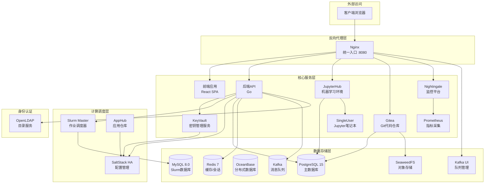
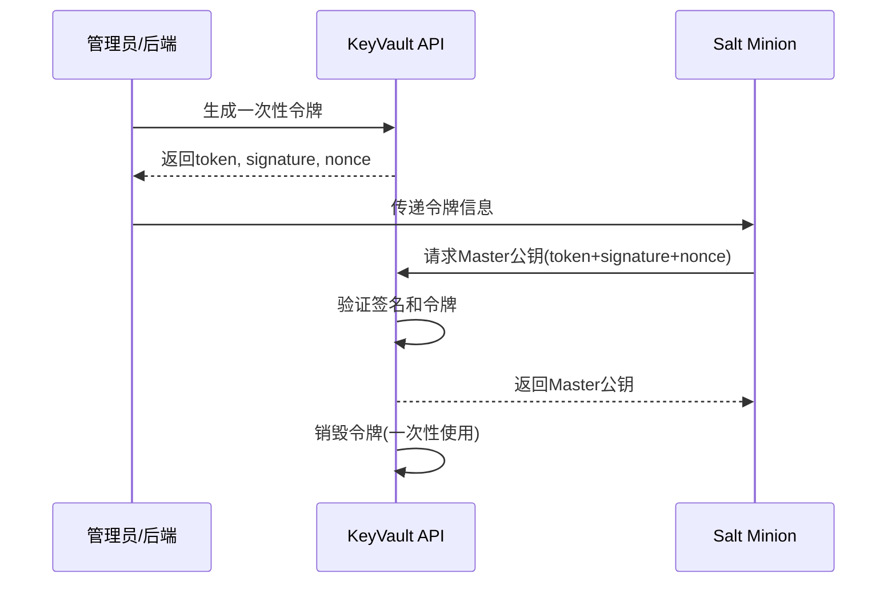

# AI Infrastructure Matrix

[](https://opensource.org/licenses/Apache-2.0)
[](https://www.docker.com/)
[](https://github.com/aresnasa/ai-infra-matrix)

**中文** | **[English](README.md)**

> 企业级AI基础设施平台 - 集成HPC调度、机器学习环境、代码协作与统一监控

## 🌟 项目简介

AI Infrastructure Matrix 是一个企业级HPC与AI基础设施平台，提供Slurm集群管理、JupyterHub机器学习环境、Gitea代码仓库、对象存储以及Nightingale监控系统。通过容器化架构和统一的Web管理界面，实现开箱即用的AI/HPC开发和部署解决方案。

## help 101

```bash
# 查看所有镜像清单
./build.sh list-images registry.internal.com/ai-infra

# 导出所有镜像到内部仓库
./build.sh export-all registry.internal.com/ai-infra v0.3.8

# 推送依赖镜像到内部仓库
./build.sh push-dep registry.internal.com/ai-infra/

# 模拟模式（测试不实际执行docker操作）
SKIP_DOCKER_OPERATIONS=true ./build.sh export-all registry.example.com v0.3.8
```


### 核心特性

- 🖥️ **Slurm HPC调度** - 企业级作业调度系统，支持集群管理和资源调度
- 🛠️ **SaltStack自动化** - 自动化配置管理和节点部署
- 🔐 **KeyVault安全管理** - 安全的密钥和证书分发，一次性令牌机制
- 📦 **AppHub应用仓库** - Slurm/Categraf等应用包的构建和分发
- 🐍 **JupyterHub集成** - 多用户Jupyter环境，支持GPU计算
- 🗃️ **Gitea代码仓库** - 轻量级Git服务，支持S3对象存储后端
- 📦 **SeaweedFS对象存储** - S3兼容的高性能分布式对象存储
- 📊 **Nightingale监控** - 全栈监控告警平台
- 🚀 **容器化部署** - Docker Compose一键部署，支持多环境配置
- 🌐 **多注册表支持** - 支持Docker Hub、阿里云ACR、Harbor等镜像仓库

## 🏗️ 系统架构



## 📦 组件清单

### 核心服务 (`src/`)

| 组件 | 说明 | 技术栈 |
|------|------|--------|
| `backend` | 后端API服务 | Go, Gin, GORM |
| `frontend` | Web前端 | React, Ant Design |
| `nginx` | 反向代理 | Nginx Alpine |
| `saltstack` | 配置管理（高可用） | SaltStack, Salt-API |
| `apphub` | 应用包仓库 | AlmaLinux, RPM/DEB |
| `jupyterhub` | 机器学习环境 | JupyterHub, Python |
| `singleuser` | Jupyter笔记本实例 | Jupyter, CUDA |
| `gitea` | Git代码仓库 | Gitea 1.25 |
| `nightingale` | 监控平台 | Nightingale, Go |
| `prometheus` | 指标采集 | Prometheus |
| `slurm-master` | HPC作业调度 | Slurm 25.05 |

### 数据服务

| 组件 | 版本 | 说明 |
|------|------|------|
| PostgreSQL | 15-alpine | 主数据库 |
| MySQL | 8.0 | Slurm账户数据库 |
| OceanBase | 4.3.5-lts | 分布式数据库 |
| Redis | 7-alpine | 缓存和会话存储 |
| Kafka | 7.5.0 | 消息队列 |
| SeaweedFS | latest | S3兼容对象存储 |

### 身份认证与安全

| 组件 | 说明 |
|------|------|
| OpenLDAP | 用户认证目录服务 |
| PHPLDAPAdmin | LDAP Web管理界面 |
| KeyVault | 安全密钥分发服务 |

## 🚀 快速开始

### 前置要求

- Docker 20.10+
- Docker Compose 2.0+
- Git
- 4GB+ 可用内存

### 一键部署

```bash
# 克隆项目
git clone https://github.com/aresnasa/ai-infra-matrix.git
cd ai-infra-matrix

# 配置环境变量
cp .env.example .env
# 编辑 .env 文件，配置必要的参数

# 构建并启动服务
./build.sh build-all v0.3.8
docker compose up -d
```

### 访问服务

部署完成后，通过浏览器访问：

- 🌐 **主页**: <http://localhost:8080>
- 📊 **JupyterHub**: <http://localhost:8080/jupyter>
- 🗃️ **Gitea**: <http://localhost:8080/gitea/>
- 📈 **Nightingale**: <http://localhost:8080/n9e>
- 📦 **SeaweedFS控制台**: <http://localhost:8080/seaweedfs/>

默认管理员账号：`admin` / `admin123`

## 📚 文档导航

### 用户文档

- [用户操作手册](docs/zh_CN/USER_GUIDE.md)
- [API文档](docs/zh_CN/API_REFERENCE.md)

### 部署文档

- [Docker Hub推送指南](docs/zh_CN/DOCKER-HUB-PUSH.md)
- [Kubernetes部署](docs/zh_CN/KUBERNETES_DEPLOYMENT.md)
- [Helm Chart指南](docs/zh_CN/HELM_GUIDE.md)

### 运维文档

- [系统监控](docs/zh_CN/MONITORING.md)
- [故障排除](docs/zh_CN/TROUBLESHOOTING.md)
- [备份恢复](docs/zh_CN/BACKUP_RECOVERY.md)

### 架构文档

- [系统架构设计](docs/zh_CN/ARCHITECTURE.md)
- [认证系统设计](docs/zh_CN/AUTHENTICATION.md)
- [Salt Key安全分发](docs-all/SALT_KEY_SECURITY.md)

### 英文文档

English documentation is available in [docs/en/](docs/en/)

## 🛠️ 构建与部署

### 环境初始化

```bash
# 自动检测并初始化 .env 文件（推荐）
./build.sh init-env

# 使用指定的外部地址
./build.sh init-env 192.168.0.100

# 强制重新初始化
./build.sh init-env --force
```

### 生产环境配置生成

```bash
# 生成带有安全随机密码的 .env.prod（生产部署推荐）
./build.sh gen-prod-env

# 指定输出文件
./build.sh gen-prod-env .env.production

# 强制覆盖现有文件
./build.sh gen-prod-env --force
```

**生成的密码变量：**
- 数据库：`POSTGRES_PASSWORD`、`MYSQL_ROOT_PASSWORD`、`REDIS_PASSWORD`
- 认证：`JWT_SECRET`、`ENCRYPTION_KEY`、`SESSION_SECRET`、`JUPYTERHUB_CRYPT_KEY`
- 存储：`SEAWEEDFS_ACCESS_KEY`、`SEAWEEDFS_SECRET_KEY`
- 服务：`GITEA_ADMIN_PASSWORD`、`GITEA_ADMIN_TOKEN`
- LDAP：`LDAP_ADMIN_PASSWORD`、`LDAP_CONFIG_PASSWORD`
- Slurm：`SLURM_DB_PASSWORD`、`SLURM_MUNGE_KEY`
- 自动化：`SALT_API_PASSWORD`、`SALTSTACK_API_TOKEN`

**使用生成的生产环境配置：**

```bash
# 步骤 1: 生成生产环境配置文件
./build.sh gen-prod-env

# 步骤 2: 检查并自定义设置
vi .env.prod
# - 设置 EXTERNAL_HOST 为服务器 IP 或域名
# - 设置 DOMAIN 用于域名访问
# - 根据需要调整其他设置

# 步骤 3: 应用到部署
cp .env.prod .env

# 步骤 4: 使用新配置渲染模板
./build.sh render

# 步骤 5: 构建并部署
./build.sh build-all
docker compose up -d
```

> ⚠️ **重要安全提示：**
>
> - 请安全保存生成的密码（推荐使用密码管理器）
> - 默认管理员账号 `admin/admin123` 不会被此脚本修改
> - **首次登录后请立即通过 Web 界面修改管理员密码**
> - 切勿将 `.env.prod` 提交到版本控制系统

### 模板渲染

```bash
# 渲染所有 Dockerfile.tpl 和配置模板
./build.sh render

# 强制重新渲染（忽略缓存）
./build.sh render --force
```

### 构建命令

```bash
# 构建所有服务（按正确顺序）
./build.sh build-all

# 强制重建所有服务（无缓存）
./build.sh build-all --force

# 构建单个组件
./build.sh backend
./build.sh frontend

# 强制重建单个组件
./build.sh backend --force
```

### 服务管理

```bash
# 启动所有服务
./build.sh start-all

# 停止所有服务
./build.sh stop-all

# 为私有仓库镜像打本地标签
./build.sh tag-images
```

### 镜像拉取（智能模式）

```bash
# 预拉取所有基础镜像
./build.sh prefetch

# 拉取公共/第三方镜像（mysql, redis, kafka等）
./build.sh pull-common

# 互联网模式：从 Docker Hub 拉取
./build.sh pull-all

# 内网模式：从私有仓库拉取（需要 project 路径）
./build.sh pull-all harbor.example.com/ai-infra v0.3.8

# 拉取依赖镜像
./build.sh deps-pull harbor.example.com/ai-infra v0.3.8
```

### 镜像推送

```bash
# 推送单个服务到仓库
./build.sh push backend harbor.example.com/ai-infra v0.3.8

# 推送所有镜像（4个阶段：通用、依赖、项目、特殊）
./build.sh push-all harbor.example.com/ai-infra v0.3.8

# 推送依赖镜像
./build.sh push-dep harbor.example.com/ai-infra v0.3.8
```

> ⚠️ **Harbor 私有仓库注意事项**：路径必须包含项目名
>
> - ✓ `harbor.example.com/ai-infra`（正确）
> - ✗ `harbor.example.com`（错误 - 缺少项目名）

### 离线部署

```bash
# 导出所有镜像到 tar 文件
./build.sh export-offline ./offline-images v0.3.8

# 导出时排除公共镜像
./build.sh export-offline ./offline-images v0.3.8 false

# 在离线环境导入
cd ./offline-images && ./import-images.sh
```

### 清理命令

```bash
# 清理项目镜像（可选指定标签）
./build.sh clean-images v0.3.8

# 清理项目数据卷
./build.sh clean-volumes

# 完全清理（停止容器、删除镜像和数据卷）
./build.sh clean-all --force
```

### 全局选项

所有命令都支持以下全局选项：

- `--force` / `-f` / `--no-cache`：强制重建，不使用 Docker 缓存

### 模拟模式

```bash
# 测试模式：跳过实际的 Docker 操作
SKIP_DOCKER_OPERATIONS=true ./build.sh export-all registry.example.com v0.3.8
```

## ⚙️ SLURM 配置与 MPI

- 全局 `slurm.conf` 模板现在存放在 `src/backend/config/slurm/slurm.conf.base`，后端服务会在每次下发配置前动态读取该文件并追加节点/分区信息。
- 如需放置在其他位置，可通过环境变量 `SLURM_BASE_CONFIG_PATH` 显式指定模板路径；该文件会被同步到 `slurm-master` 与所有计算节点容器中。
- 模板内启用了 `MpiDefault=pmix`，所以需要在自定义镜像或物理节点中提供 `pmix`/`libpmix` 运行时（项目提供的 `slurm-master` 镜像与自动化节点安装脚本已默认安装这些依赖）。
- 修改模板后可以直接调用"刷新 SLURM 配置"按钮或 `UpdateSlurmConfig` 接口立即同步，无需重新编译后端程序。

## 🎯 主要功能

### 🖥️ Slurm HPC调度系统

- 作业提交和队列管理
- 节点资源监控和分配
- 分区(Partition)配置
- 集成SaltStack自动化部署

### 🛠️ SaltStack配置管理

- 自动化节点部署
- 配置文件同步
- 远程命令执行
- Minion状态管理
- **安全密钥分发** - 一次性令牌机制确保Salt Master公钥安全传输

### 🔐 KeyVault安全服务

KeyVault 是平台的安全密钥管理服务，提供：

- **一次性令牌机制** - 生成一次性使用的安全令牌用于密钥分发
- **Salt Master公钥安全分发** - 确保Minion节点安全获取Master公钥
- **HMAC签名验证** - 使用HMAC-SHA256签名确保请求完整性
- **Nonce重放防护** - 防止令牌重放攻击
- **自动过期机制** - 令牌默认5分钟有效期，可配置

**工作流程：**



**安全特性：**

- ✅ 令牌一次性使用，获取后立即销毁
- ✅ HMAC签名防止令牌篡改
- ✅ Nonce防止重放攻击
- ✅ 令牌有效期限制
- ✅ 请求超时限制(默认10秒)

详见 [Salt Key安全分发设计文档](docs-all/SALT_KEY_SECURITY.md)

### 📦 AppHub应用仓库

- Slurm RPM/DEB包构建
- Categraf监控代理打包
- 多架构支持(x86_64/aarch64)
- 版本管理和分发

### 📊 JupyterHub机器学习平台

- 多用户Jupyter环境
- GPU资源支持
- 自定义镜像管理
- 持久化存储

### 🗃️ Gitea代码仓库

- Git仓库托管
- Pull Request工作流
- S3对象存储后端
- Web界面管理

### 📦 SeaweedFS对象存储

- S3兼容API
- 高性能分布式存储
- Gitea LFS后端存储
- Filer Web管理控制台

### 📈 Nightingale监控系统

- 指标采集和展示
- 告警规则配置
- 仪表盘可视化
- Prometheus兼容

### 👥 RBAC权限管理系统

平台提供完整的基于角色的访问控制(RBAC)系统：

**预定义角色模板：**

| 角色模板 | 说明 | 主要权限 |
|----------|------|----------|
| `admin` | 系统管理员 | 所有权限 |
| `sre` | SRE运维工程师 | SaltStack、Ansible、Kubernetes、主机管理 |
| `data-developer` | 数据开发人员 | JupyterHub、项目管理、数据分析 |
| `model-developer` | 模型开发人员 | JupyterHub、项目管理 |
| `engineer` | 工程研发人员 | Kubernetes、项目管理 |

**特性：**

- 🔐 角色继承和权限组合
- 🔑 资源级别权限控制
- 👥 用户组管理
- 📋 权限审计日志

## 🔧 配置管理

### 环境变量配置

```bash
# 开发环境
cp .env.example .env
vi .env

# 生产环境  
cp .env.example .env.prod
vi .env.prod
```

### 关键配置项

| 配置项 | 说明 | 默认值 |
|--------|------|--------|
| `POSTGRES_PASSWORD` | PostgreSQL数据库密码 | `postgres` |
| `MYSQL_ROOT_PASSWORD` | MySQL root密码 | `mysql123` |
| `SLURM_DB_PASSWORD` | Slurm数据库密码 | `slurm123` |
| `SEAWEEDFS_S3_ACCESS_KEY` | SeaweedFS S3访问密钥 | `seaweedfs_admin` |
| `SEAWEEDFS_S3_SECRET_KEY` | SeaweedFS S3秘密密钥 | `seaweedfs_secret_key_change_me` |
| `ADMIN_USER` | Web管理员用户名 | `admin` |
| `ADMIN_PASSWORD` | Web管理员密码 | `admin123` |
| `EXTERNAL_HOST` | 外部访问地址 | `localhost` |
| `EXTERNAL_PORT` | 外部访问端口 | `8080` |

## 🧪 测试与验证

### 健康检查

```bash
# 查看服务状态
docker compose ps

# 查看服务日志
docker compose logs -f [服务名]

# 测试API端点
curl http://localhost:8080/api/health
```

## 📈 监控与维护

### 服务状态监控

```bash
# 查看服务状态
docker compose ps

# 查看服务日志
docker compose logs -f [服务名]

# 访问Nightingale监控面板
# http://localhost:8080/n9e
```

### 数据备份

```bash
# PostgreSQL备份
docker exec ai-infra-postgres pg_dump -U postgres ai-infra-matrix > backup.sql

# MySQL备份
docker exec ai-infra-mysql mysqldump -u root -p slurm_acct_db > slurm_backup.sql

# SeaweedFS数据备份
aws --endpoint-url http://localhost:8333 s3 sync s3://gitea ./seaweedfs_backup/
```

## 🤝 贡献指南

我们欢迎所有形式的贡献！请遵循以下步骤：

1. Fork 本仓库
2. 创建功能分支 (`git checkout -b feature/amazing-feature`)
3. 提交更改 (`git commit -m 'Add amazing feature'`)
4. 推送到分支 (`git push origin feature/amazing-feature`)
5. 创建 Pull Request

### 开发规范

- 遵循Go和JavaScript代码规范
- 编写完整的测试用例
- 更新相关文档
- 提交前运行完整测试套件

## 📄 许可证

本项目采用 Apache License 2.0 许可证。详见 [LICENSE](LICENSE) 文件。

## 🙋 支持与反馈

- 📧 邮箱：[ai_infra_matrix](mailto:ai_infra_matrix@126.com)
- 🐛 问题反馈：[GitHub Issues](https://github.com/aresnasa/ai-infra-matrix/issues)
- 💬 讨论交流：[GitHub Discussions](https://github.com/aresnasa/ai-infra-matrix/discussions)

## 🎉 致谢

感谢以下开源项目的支持：

- [Slurm](https://slurm.schedmd.com/) - HPC作业调度系统
- [SaltStack](https://saltproject.io/) - 配置管理和自动化
- [JupyterHub](https://jupyterhub.readthedocs.io/) - 多用户Jupyter环境
- [Gitea](https://gitea.io/) - 轻量级Git服务
- [SeaweedFS](https://github.com/seaweedfs/seaweedfs) - 高性能分布式对象存储
- [Nightingale](https://n9e.github.io/) - 监控告警平台
- [PostgreSQL](https://www.postgresql.org/) - 高性能关系数据库
- [MySQL](https://www.mysql.com/) - 开源关系数据库
- [OceanBase](https://www.oceanbase.com/) - 分布式数据库
- [Redis](https://redis.io/) - 内存数据结构存储
- [Kafka](https://kafka.apache.org/) - 分布式消息队列
- [React](https://reactjs.org/) - 用户界面库
- [Go](https://golang.org/) - 高性能编程语言

---

**AI Infrastructure Matrix** - 让AI开发更简单

[官网](https://ai-infra-matrix.example.com) • [文档](docs/zh_CN/) • [演示](https://demo.ai-infra-matrix.example.com)

---

## 附录：对象存储（SeaweedFS）环境变量速览

- 代理路由：/seaweedfs/ (Filer Web UI)，/seaweedfs-s3/ (S3 API)
- 关键环境变量（.env/.env.example）：
  - SEAWEEDFS_S3_ACCESS_KEY, SEAWEEDFS_S3_SECRET_KEY
  - SEAWEEDFS_MASTER_URL, SEAWEEDFS_FILER_URL, SEAWEEDFS_S3_PORT
  - SEAWEEDFS_JWT_SECRET
  - SEAWEEDFS_BUCKET_GITEA（Gitea 使用的桶名，默认 gitea）

修改上述变量后，重新渲染/构建并重启服务以生效。
