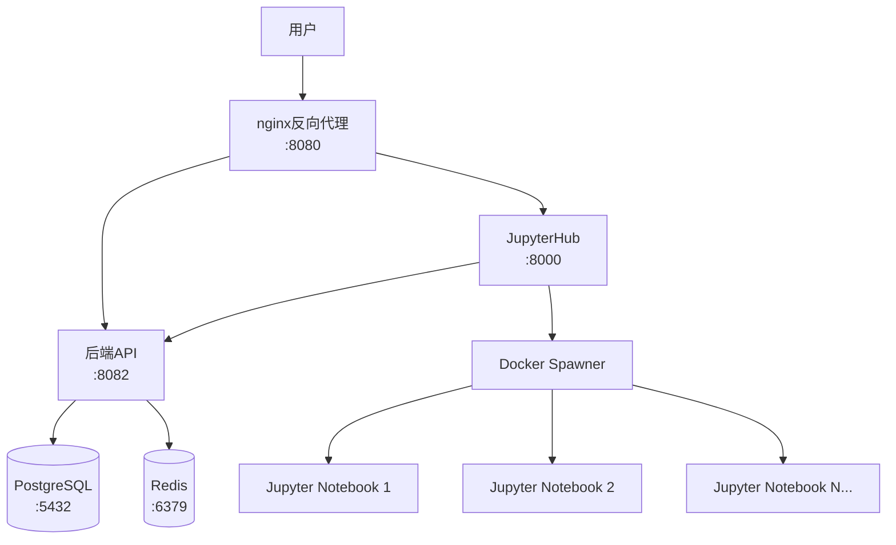

# AI Infrastructure Matrix

> 现代化的AI基础设施平台，提供安全的JupyterHub环境和统一身份验证

## 🎯 项目概述

AI Infrastructure Matrix 是一个生产就绪的AI基础设施解决方案：

- **🔐 统一身份验证**: 后端API集成的用户管理系统
- **📊 JupyterHub**: 多用户Jupyter环境，支持CPU/GPU计算
- **🌐 nginx反向代理**: 安全访问控制，隐藏后端服务
- **🐳 容器化部署**: 完整的Docker解决方案，一键部署

## ⚡ 快速开始

### 1. 系统要求

- Docker >= 20.10
- Docker Compose >= 2.0
- 4GB+ RAM 推荐
- macOS/Linux/Windows (WSL2)

### 2. 一键部署

```bash
# 克隆项目
git clone <your-repo-url>
cd ai-infra-matrix

# 配置环境变量
cp .env.jupyterhub.example .env

# 启动服务
./deploy.sh
```

### 3. 访问服务

- **🏠 JupyterHub**: <http://localhost:8080/jupyter/>
- **👤 默认登录**: `admin` / `admin123`

## 📁 项目结构

```
ai-infra-matrix/
├── 🏗️ 核心配置
│   ├── docker-compose.yml      # Docker 部署配置
│   ├── deploy.sh               # 部署脚本
│   └── .env.jupyterhub.example # 环境变量模板
├── 💻 源代码
│   ├── src/jupyterhub/         # JupyterHub 配置
│   ├── src/nginx/              # nginx 代理配置
│   └── docker/                 # Docker 镜像
├── 💾 数据存储
│   ├── data/                   # 持久化数据
│   └── shared/                 # 共享存储
└── 🗃️ 开发归档
    └── archive/                # 开发过程文件
```

## 🏗️ 系统架构



## 🔧 管理命令

```bash
# 查看服务状态
docker-compose ps

# 查看日志
docker-compose logs -f
docker-compose logs nginx

# 重启服务
docker-compose restart

# 停止服务
docker-compose down
```

## 🚀 特性

### ✅ 安全特性

- **反向代理保护**: 后端服务不直接暴露
- **统一认证**: 集成的用户管理和权限控制
- **会话管理**: 安全的cookie和CSRF保护
- **容器隔离**: 每个用户独立的Jupyter环境

### ✅ 开发体验

- **一键部署**: 单个命令启动完整环境
- **热重载**: 开发时配置自动更新
- **日志聚合**: 统一的日志查看和管理
- **健康检查**: 自动服务状态监控

### ✅ 生产就绪

- **持久化存储**: 数据和配置持久保存
- **扩展性**: 支持水平扩展和负载均衡
- **监控集成**: 完整的监控和告警支持
- **备份恢复**: 数据备份和灾难恢复

## 📚 文档

- [部署指南](dev_doc/02-03-deployment-guide.md)
- [架构设计](dev_doc/01-01-ai-middleware-architecture.md)
- [用户认证指南](docs/JUPYTERHUB_UNIFIED_AUTH_GUIDE.md)
- [项目结构说明](PROJECT_STRUCTURE.md)

## 🔧 故障排除

### 常见问题

1. **端口占用**: 确保8080端口未被占用
2. **权限问题**: 确保Docker有足够权限
3. **内存不足**: 建议至少4GB可用内存
4. **网络问题**: 检查Docker网络配置

### 获取帮助

```bash
# 检查服务健康状态
./deploy.sh health

# 重置环境
./deploy.sh clean && ./deploy.sh

# 查看详细日志
docker-compose logs --tail=100
```

## 📝 许可证

此项目基于 MIT 许可证开源。详见 [LICENSE](LICENSE) 文件。

---

**🎉 现在您已经拥有了一个生产就绪的AI基础设施平台！**

如需查看完整的开发历史和调试信息，请查看 `archive/` 目录。
