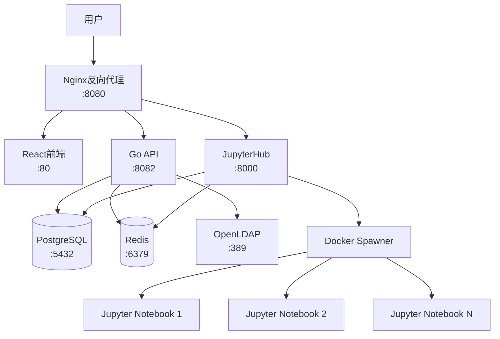

# AI Infrastructure Matrix

> 统一的AI基础设施平台，集成Ansible Playbook生成、JupyterHub、身份验证和DevOps工具链

## 🎯 项目概述

AI Infrastructure Matrix 是一个完整的AI基础设施解决方案，通过统一的Nginx反向代理提供：

- **Ansible Playbook Generator**: 智能的基础设施代码生成器
- **JupyterHub**: 多用户Jupyter环境，统一身份验证
- **DevOps工具链**: LDAP、PostgreSQL、Redis等完整技术栈
- **统一访问入口**: 通过单一端口(8080)访问所有服务

## 🚀 快速开始

### 1. 系统要求

- Docker >= 20.10
- Docker Compose >= 2.0
- 8GB+ RAM 推荐
- macOS/Linux/Windows (WSL2)

### 2. 一键部署

```bash
# 克隆项目
git clone <your-repo-url>
cd ai-infra-matrix

# 启动基础服务 + JupyterHub
./deploy.sh up --with-jupyterhub

# 或启动完整开发环境
./deploy.sh dev
```

### 3. 访问地址

| 服务 | 地址 | 说明 |
|------|------|------|
| 🏠 **主页** | <http://localhost:8080> | React前端界面 |
| 🔗 **API** | <http://localhost:8080/api> | 后端REST API |
| 📊 **JupyterHub** | <http://localhost:8080/jupyter> | 多用户Jupyter环境 |
| � **API文档** | <http://localhost:8080/swagger> | Swagger API文档 |
| 🔧 **LDAP管理** | <http://localhost:8080/ldap-admin> | LDAP管理界面 (--with-admin) |
| � **Redis监控** | <http://localhost:8080/redis-monitor> | Redis监控界面 (--with-monitoring) |

> 注意：所有服务都通过Nginx统一入口访问，无需记忆多个端口

### 4. 默认凭据

```bash
# JupyterHub管理员
用户名: admin
密码: admin

# 数据库
用户名: postgres
密码: postgres

# Redis
密码: ansible-redis-password
```

## 🏗️ 架构设计



## 🔧 管理命令

### 服务管理

```bash
# 查看服务状态
./deploy.sh status

# 查看日志
./deploy.sh logs
./deploy.sh logs --service nginx

# 重启服务
./deploy.sh restart
./deploy.sh restart --service backend

# 健康检查
./deploy.sh health
```

### 开发模式

```bash
# 启动开发环境（包含管理界面和监控）
./deploy.sh dev

# 启动生产环境
./deploy.sh prod

# 重新构建镜像
./deploy.sh build

# 更新并重新部署
./deploy.sh update
```

### 系统清理

```bash
# 停止所有服务
./deploy.sh down

# 清理所有资源（谨慎使用）
./deploy.sh clean --force
```

## 📁 项目结构

```text
ai-infra-matrix/
├── deploy.sh                 # 🚀 统一部署脚本
├── docker-compose.yml        # 🐳 主配置文件
├── .env                      # ⚙️ 环境变量
├── README.md                 # 📖 主文档
├── 
├── src/                      # 📦 源代码
│   ├── backend/              # 🔧 Go后端API
│   │   ├── Dockerfile
│   │   ├── main.go
│   │   └── ...
│   ├── frontend/             # 🌐 React前端
│   │   ├── Dockerfile
│   │   ├── package.json
│   │   └── ...
│   ├── jupyterhub/           # 📊 JupyterHub配置
│   │   ├── Dockerfile
│   │   ├── jupyterhub_config.py
│   │   └── ...
│   └── nginx/                # 🔀 Nginx配置
│       └── nginx.conf
├── 
├── docs/                     # 📚 文档
├── scripts/                  # 🛠️ 工具脚本
├── examples/                 # 💡 示例
└── dev_doc/                  # 📋 开发文档
```

## ⚙️ 配置说明

### 环境变量

主要配置文件：`.env`

```bash
# 项目配置
COMPOSE_PROJECT_NAME=ai-infra-matrix
LOG_LEVEL=info

# 安全配置
JWT_SECRET=your-secret-key-here

# 数据库配置
POSTGRES_DB=ansible_playbook_generator
POSTGRES_USER=postgres
POSTGRES_PASSWORD=postgres

# Redis配置
REDIS_PASSWORD=your-redis-password

# JupyterHub配置
JUPYTERHUB_ADMIN_USERS=admin,jupyter-admin
CONFIGPROXY_AUTH_TOKEN=your-proxy-token
```

### Docker Compose Profiles

```bash
# 基础服务（默认）
./deploy.sh up

# 包含JupyterHub
./deploy.sh up --with-jupyterhub

# 包含Kubernetes代理
./deploy.sh up --with-k8s

# 包含监控服务
./deploy.sh up --with-monitoring

# 包含管理界面
./deploy.sh up --with-admin

# 启动所有服务
./deploy.sh up --all
```

## 🔐 安全配置

### 生产环境部署

1. **修改默认密码**

```bash
# 编辑 .env 文件
vi .env

# 修改以下配置
JWT_SECRET=your-production-secret-key
POSTGRES_PASSWORD=your-secure-password
REDIS_PASSWORD=your-secure-redis-password
CONFIGPROXY_AUTH_TOKEN=your-secure-proxy-token
```

2. **启用HTTPS**

```bash
# 将SSL证书放入 src/nginx/ssl/ 目录
# 修改 src/nginx/nginx.conf 启用SSL配置
```

3. **网络安全**

```bash
# 仅暴露必要端口
# 配置防火墙规则
# 使用生产级密码策略
```

## 🧪 开发指南

### 添加新服务

1. 在 `src/` 目录创建服务文件夹
2. 添加 `Dockerfile`
3. 在 `docker-compose.yml` 中添加服务定义
4. 更新 `src/nginx/nginx.conf` 路由配置
5. 测试部署

### 数据库迁移

```bash
# 备份数据
docker exec ai-infra-postgres pg_dump -U postgres ansible_playbook_generator > backup.sql

# 恢复数据
docker exec -i ai-infra-postgres psql -U postgres ansible_playbook_generator < backup.sql
```

### 调试模式

```bash
# 启用详细日志
LOG_LEVEL=debug ./deploy.sh up

# 查看特定服务日志
./deploy.sh logs --service backend --follow

# 进入容器调试
docker exec -it ai-infra-backend /bin/bash
```

## 🐛 故障排除

### 常见问题

1. **端口冲突**

```bash
# 检查端口占用
lsof -i :8080
lsof -i :5433

# 修改端口配置
vi docker-compose.yml
```

2. **服务启动失败**

```bash
# 查看详细日志
./deploy.sh logs --service <service-name>

# 检查健康状态
./deploy.sh health

# 重新构建镜像
./deploy.sh build
```

3. **权限问题**

```bash
# 检查Docker权限
sudo usermod -aG docker $USER
newgrp docker

# 检查文件权限
chmod +x deploy.sh
```

4. **内存不足**

```bash
# 检查系统资源
docker stats

# 调整内存限制
vi docker-compose.yml
# 修改 mem_limit 配置
```

### 日志位置

```bash
# 容器日志
docker logs ai-infra-<service>

# Nginx日志
docker exec ai-infra-nginx cat /var/log/nginx/access.log
docker exec ai-infra-nginx cat /var/log/nginx/error.log

# 应用日志
./deploy.sh logs --service backend
./deploy.sh logs --service jupyterhub
```

## 🤝 贡献指南

1. Fork 项目
2. 创建特性分支 (`git checkout -b feature/AmazingFeature`)
3. 提交变更 (`git commit -m 'Add some AmazingFeature'`)
4. 推送分支 (`git push origin feature/AmazingFeature`)
5. 开启 Pull Request

## 📄 许可证

本项目基于 MIT 许可证开源 - 查看 [LICENSE](LICENSE) 文件了解详情

## 🆘 获取帮助

- **文档**: [docs/](docs/)
- **示例**: [examples/](examples/)
- **问题反馈**: GitHub Issues
- **邮件支持**: <ai-infra-support@example.com>

## 🎉 致谢

感谢所有为本项目做出贡献的开发者！

---

**AI Infrastructure Matrix** - 让基础设施管理变得简单而强大！ 🚀
