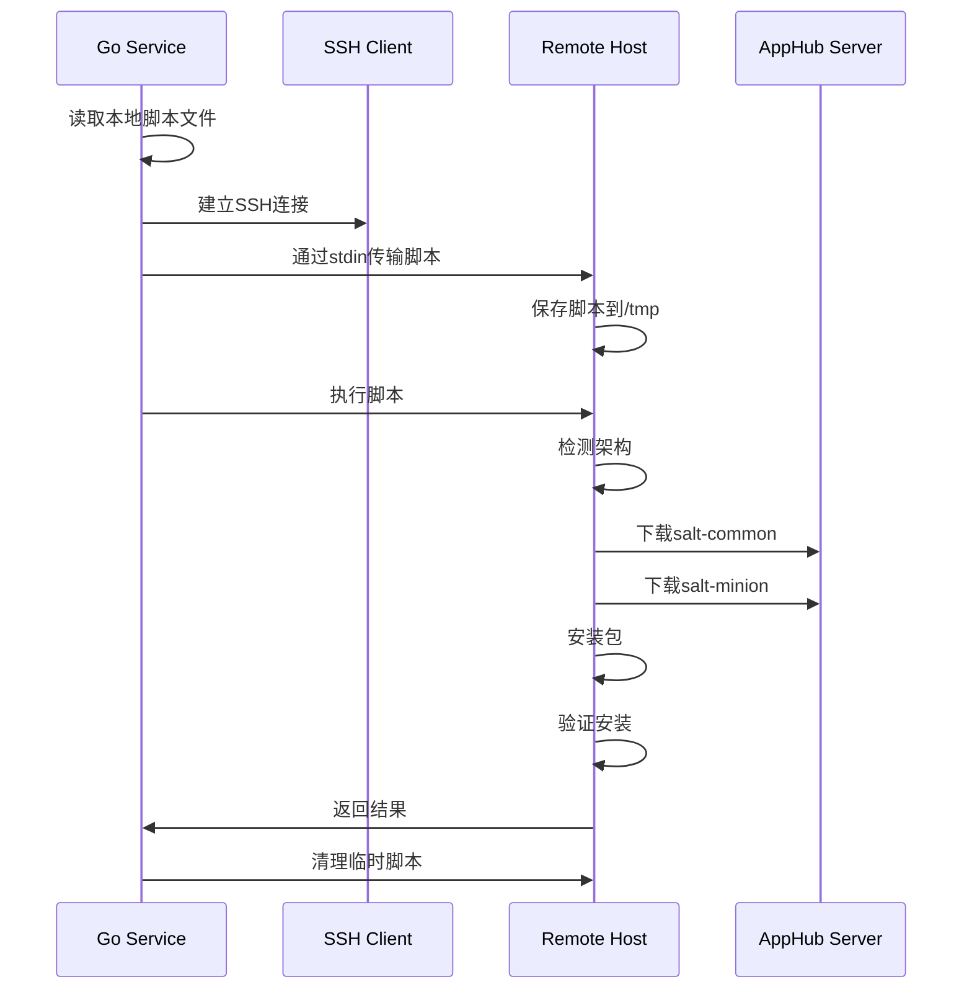

# SaltStack Minion 安装脚本重构

## 概述

将 SaltStack Minion 安装逻辑从 Go 代码中的嵌入式 bash 脚本重构为独立的脚本文件，提高了可维护性和可读性。

## 变更内容

### 1. 创建独立的安装脚本

**位置**: `src/backend/scripts/`

- **`install-salt-minion-deb.sh`**: Ubuntu/Debian 系统的 SaltStack Minion 安装脚本
- **`install-salt-minion-rpm.sh`**: CentOS/RHEL/Rocky Linux 系统的 SaltStack Minion 安装脚本

**特性**:
- 从 AppHub 下载 SaltStack 包
- 自动检测系统架构（amd64/arm64 for deb, x86_64/aarch64 for rpm）
- 完整的错误处理和日志输出
- 安装后验证

**使用方法**:
```bash
# Debian/Ubuntu
./install-salt-minion-deb.sh <APPHUB_URL> <SALT_VERSION>

# CentOS/RHEL
./install-salt-minion-rpm.sh <APPHUB_URL> <SALT_VERSION>
```

**示例**:
```bash
./install-salt-minion-deb.sh http://192.168.0.200:53434 3007.8
```

### 2. 修改 Go 代码

**文件**: `src/backend/internal/services/slurm_cluster_service_extended.go`

**变更**:
- `installSaltMinionPackage()`: 从嵌入 bash 脚本改为调用外部脚本文件
- `copyScriptToRemote()`: 新增函数，通过 SSH stdin 复制脚本到远程主机
- `getSaltStackVersion()`: 从环境变量读取 SaltStack 版本
- `getAppHubBaseURL()`: 从环境变量构建 AppHub URL

**技术细节**:
- 使用 SSH stdin pipe 传输脚本，无需 SFTP 依赖
- 脚本在容器内路径: `/root/scripts/`
- 远程执行路径: `/tmp/install-salt-minion.sh`
- 执行后自动清理

### 3. 更新 Dockerfile

**文件**: `src/backend/Dockerfile`

**变更**:
```dockerfile
# Copy installation scripts for remote execution
COPY scripts/ /root/scripts/
RUN chmod +x /root/scripts/*.sh
```

### 4. 环境变量配置

**文件**: `.env` 和 `.env.example`

**新增配置**:
```bash
# SaltStack 版本配置
SALTSTACK_VERSION=3007.8
```

## 优势

### 1. **可维护性提升**
- bash 脚本独立文件，便于编辑和测试
- 语法高亮和代码提示支持
- 可以单独运行和调试

### 2. **代码清晰度**
- Go 代码专注于业务逻辑
- bash 脚本专注于系统操作
- 职责分离明确

### 3. **灵活性**
- 脚本可以独立更新，无需重新编译 Go 代码
- 支持版本控制和回滚
- 易于扩展支持其他操作系统

### 4. **无额外依赖**
- 不需要 SFTP 库（`github.com/pkg/sftp`）
- 使用标准 SSH 功能传输脚本
- 减少外部依赖和镜像大小

## 安装流程



## 配置说明

### AppHub URL 构建优先级

1. 环境变量 `APPHUB_URL`（如果设置）
2. 根据以下变量构建：
   - `EXTERNAL_HOST` (默认: localhost)
   - `APPHUB_PORT` (默认: 53434)
   - `EXTERNAL_SCHEME` (默认: http)
   
   构建格式: `{SCHEME}://{HOST}:{PORT}`

### SaltStack 版本

- 环境变量: `SALTSTACK_VERSION`
- 默认值: `3007.8`
- 格式: 不带 'v' 前缀的版本号

## 使用示例

### 重新构建 Backend 镜像

```bash
docker-compose build backend
```

### 重启服务

```bash
docker-compose restart backend
```

### 查看日志

```bash
docker-compose logs -f backend
```

## 测试

### 手动测试脚本

在容器内测试:
```bash
docker exec -it ai-infra-backend bash
/root/scripts/install-salt-minion-deb.sh http://192.168.0.200:53434 3007.8
```

### 通过 API 测试

创建 SLURM 集群并观察 SaltStack Minion 安装日志。

## 故障排查

### 脚本未找到
```
Error: failed to read script file /root/scripts/install-salt-minion-deb.sh
```
**解决**: 确保已重新构建 backend 镜像

### 无法连接 AppHub
```
Failed to download salt-common from AppHub
```
**检查**:
1. AppHub 服务是否运行
2. 网络连通性
3. APPHUB_URL 配置是否正确

### 版本不匹配
```
Salt Minion installation verification failed
```
**检查**:
1. `SALTSTACK_VERSION` 环境变量
2. AppHub 中是否有对应版本的包
3. 架构是否匹配

## 下一步

- [ ] 添加脚本单元测试
- [ ] 支持更多 Linux 发行版
- [ ] 添加安装进度回调
- [ ] 实现重试机制
- [ ] 支持自定义包源

## 参考

- SaltStack 官方文档: https://docs.saltproject.io/
- AppHub 包路径:
  - DEB: `/pkgs/saltstack-deb/`
  - RPM: `/pkgs/saltstack-rpm/`
