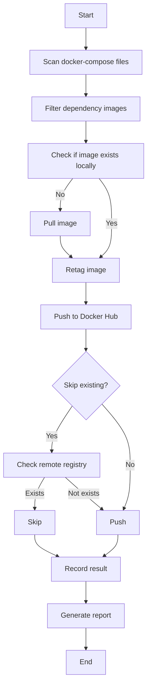

# Dependency Image Push - Docker Hub Integration

**[中文文档](../DOCKER-HUB-PUSH.md)** | **English**

## Overview

AI-Infra-Matrix now supports automatic pushing of all dependency images to Docker Hub, solving the difficulty of pulling images in restricted network environments.

## Features

### 🚀 Automatic Dependency Discovery
- Automatically scans `docker-compose.yml` files
- Identifies all third-party dependency images (excluding ai-infra-* self-built images)
- Supports multiple compose files (root directory + production environment directory)

### 📦 Smart Image Push
- Automatically retags images to specified namespace
- Supports custom Docker Hub namespace
- Automatically generates latest tags
- Option to skip existing images

### 🔧 Flexible Configuration
- Supports custom namespace
- Can skip existing images
- Detailed push progress and result reports

## Usage

### Basic Usage

```bash
# Push all dependency images to default namespace (aresnasa)
./scripts/build.sh prod --push-deps
```

### Custom Namespace

```bash
# Push to custom Docker Hub namespace
./scripts/build.sh prod --push-deps --deps-namespace myusername
```

### Skip Existing Images

```bash
# Skip already pushed images, only push new or updated ones
./scripts/build.sh prod --push-deps --skip-existing-deps
```

### Combined Usage

```bash
# Complete build and push workflow
./scripts/build.sh prod --version v1.0.0 --push-deps --deps-namespace mycompany --skip-existing-deps
```

## Prerequisites

### Docker Hub Login
```bash
# Ensure you are logged into Docker Hub
docker login
```

### Permission Requirements
- Docker Hub account
- Push permission to target namespace
- Sufficient storage quota

## Image Naming Convention

Original images will be retagged as:
```
docker.io/[namespace]/ai-infra-dep-[image-name]:[tag]
```

### Examples

| Original Image | Pushed Image |
|----------------|--------------|
| `postgres:13` | `docker.io/aresnasa/ai-infra-dep-postgres:13` |
| `redis:7-alpine` | `docker.io/aresnasa/ai-infra-dep-redis:7-alpine` |
| `nginx:latest` | `docker.io/aresnasa/ai-infra-dep-nginx:latest` |

## Complete Dependency List

The script automatically identifies the following dependency images:

### Database Services
- PostgreSQL 13
- MySQL 8.0
- Redis 7 (Alpine)
- OceanBase Community Edition

### Message Queue
- Kafka (Bitnami)
- Zookeeper (Bitnami)

### Object Storage
- MinIO

### Monitoring
- Nightingale (Flashcat)
- Categraf

### Other Services
- Nginx
- Gitea

## Push Workflow



## Troubleshooting

### Push Failed
```bash
# Check Docker Hub login status
docker info | grep Username

# Re-login
docker login

# Check network connection
curl -I https://hub.docker.com
```

### Insufficient Permissions
```bash
# Ensure the account has push permission to the namespace
# If using organization namespace, ensure proper access is configured
```

### Image Too Large
```bash
# Consider using compression
docker push --compress [image]

# Or enable buildkit for build optimization
DOCKER_BUILDKIT=1 docker build ...
```

## Best Practices

1. **Version Control**: Always use specific version tags instead of `latest`
2. **Regular Updates**: Periodically update dependency images to get security patches
3. **Private Mirror**: Consider setting up private registry for faster internal access
4. **Automation**: Integrate into CI/CD pipeline for automated pushes

## Related Documentation

- [Kubernetes Deployment Guide](KUBERNETES_DEPLOYMENT.md)
- [Helm Chart Guide](HELM_GUIDE.md)
- [Alibaba Cloud ACR Deployment Guide](ALIBABA_CLOUD_ACR_GUIDE.md)
